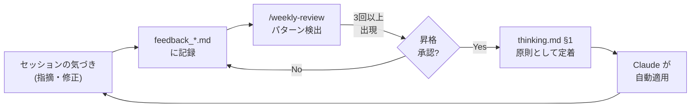
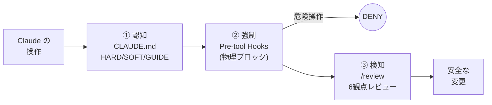
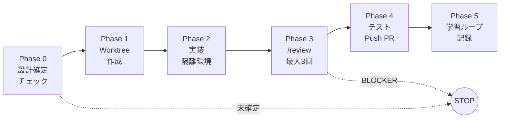

# sidekick

**Claude Code に判断を教える。そして任せる。**


Claude Code を「安全に・あなたの判断軸で・自動化する」ためのリポジトリテンプレートです。
30秒で分かる説明 → すぐ試す → 深掘り、の順で並んでいます。

---

## 30秒で言うと

sidekick は Claude Code の土台になる**リポジトリテンプレート**です。最初から次の3つが入っています:

| 🛡️ 安全ガード | 🧰 再利用ワークフロー | 🧠 思考OS |
|---|---|---|
| `rm -rf` や main 直 push など危険操作を**物理的にブロック** | `/review`、`/auto-implement` など**14スキル**が即使える | あなたの判断原則を学習し、**使うほど Claude の提案精度が上がる** |

最後の「思考OS」が sidekick の一番の差別化です。

<p align="center">
  
</p>

**この3層目（思考OS）がどう育つか:**

<p align="center">
  
</p>

---

## ぶっちゃけ、何が良くなるの？

### Before（素の Claude Code）

```
あなた : 「ログインのバグ直して」
Claude : → main で直接修正
         → テストなしで完了報告
         → そのまま git push
あなた : 「...え、main が壊れてる」
```

### After（sidekick あり）

```
あなた : 「ログインのバグ直して」
Claude : → Worktree 作成（main は触らない）
         → ステージング DB に接続確認
         → 修正 → スコープ限定テスト
         → /review（コード + テスト + 運用 の 6観点）
         → PR 作成（マージはあなたの判断）
```

**ここに、使うほど効いてくる学習ループが乗ります:**

```
セッション1: 「DB モックじゃなくステージング DB 使って」とフィードバック
セッション2: 同じ指摘（2回目を検出）
セッション3: 3回目 → 原則として thinking.md に昇格
セッション4以降: Claude の方から「ステージング DB で実行します」と提案
```

つまり、**毎回同じことを指摘する疲れ** がなくなります。

---

## 他のテンプレと何が違うの？

| | 素の Claude Code | 一般的なテンプレ | **sidekick** |
|---|:---:|:---:|:---:|
| 危険操作の物理ブロック | ❌ | △（ルール記述のみ） | ✅ hooks で強制 |
| 再利用スキル | ❌ | △ | ✅ 14 種類 |
| **あなたの判断軸を学習** | ❌ | ❌ | ✅ **思考OS** |
| 完全自動実装（寝てる間に PR） | ❌ | ❌ | ✅ `/auto-implement` |
| ADR で設計判断を追跡可能 | ❌ | △ | ✅ |

**一言でいうと**、他のテンプレが「ルール集（= 静的なドキュメント）」なのに対して、sidekick は「**育つ判断軸（= 動的なシステム）**」を提供します。

---

## よくある質問

<details>
<summary><b>Q. Claude Code 専用ですか？ Cursor / Cline / Gemini でも使える？</b></summary>

**はい、Claude Code 専用です。**

- hooks / skills / settings.json のフォーマットは Claude Code 仕様
- Cursor / Cline / Gemini では動きません

ただし「**あなたの判断軸を AI に学習させる**」という設計思想自体は他のツールにも応用可能です。
</details>

<details>
<summary><b>Q. 個人開発でも使える？ チーム向け？</b></summary>

**両方 OK。**「エンタープライズ版」は用意していません。同じ設定を規模に応じてスケールさせます。

| 設定 | 個人開発 | チーム |
|---|---|---|
| Worktree | 任意 | 必須（並行作業） |
| `/review` | セルフレビュー | チームレビューゲート |
| `PROTECTED_BRANCHES` | `main` | `main`, `release/stg` |
| `MEMORY.md` | 個人メモ | 共有コンテキスト |
</details>

<details>
<summary><b>Q. API 従量課金？ Claude Max サブスク？</b></summary>

**Claude Max サブスクリプション上で動きます。** API 従量課金は不要。10 プロジェクト動かしても月 $100 固定。（[ADR-0003](./docs/decisions/0003-slack-cron-architecture.md)）
</details>

<details>
<summary><b>Q. 既存プロジェクトに後から入れられる？</b></summary>

**入れられます。** 運用保守フェーズのプロジェクトには、**まず安全ガード（hooks）と `/review` だけ** 導入するのがおすすめ。思考OS は後から育てていけます。
</details>

---

## クイックスタート

### 1. テンプレートから作る

```bash
gh repo create my-project --template SideMountain/claude-code-sidekick
cd my-project
claude
```

既存プロジェクトに入れる場合:

```bash
cp -r sidekick/CLAUDE.md sidekick/.claude/ your-project/
cd your-project && claude
```

### 2. `/setup` を実行する

Claude Code 起動後、`/setup` を叩くと対話形式で次が進みます（所要 **約5分**）:

```
┌──────────────────────────────────────────────────┐
│ Step 1 : プロジェクト情報                         │
│  言語 / ORM / テストコマンド / ステージング有無   │
│  → CLAUDE.md に反映                               │
├──────────────────────────────────────────────────┤
│ Step 2 : 安全ガードを有効化                       │
│  rm -rf, .env 上書き, main 直 push をブロック     │
│  → settings.json + hooks/                         │
├──────────────────────────────────────────────────┤
│ Step 3 : テンプレート配置                         │
│  MEMORY.md（セッション記憶）                      │
│  CLAUDE.local.md（個人設定、gitignore 済み）      │
├──────────────────────────────────────────────────┤
│ Step 4 : あなたの判断原則（任意・スキップ可）     │
│  「何を最優先？ スピード / 安全性 / ユーザー影響」│
│  「絶対にやらないこと？」                         │
│  → thinking.md に記録（後から育てても OK）        │
└──────────────────────────────────────────────────┘
```

### 3. 試しに一つ頼んでみる

```
「README の誤字を修正して PR 出して」
```

sidekick ありだと、Claude は自動で:

1. Worktree を作る（main は守る）
2. 誤字を修正
3. `/review` で自己レビュー
4. PR を作成 → あなたがマージ

この一連が最初の体験になります。

---

## 仕組み

### 🧠 思考OS — あなたの判断軸を学習する

sidekick の一番の核。セッションのフィードバックが繰り返されると、**原則に昇格**し、Claude が以降自動適用するようになります。



**昇格判断は必ずあなたが確認します**（完全自動昇格ではない）。`/weekly-review` でパターンが提示され、OK を出したものだけが `thinking.md` に入ります。

#### 何が `thinking.md` に入る？

`thinking.md` §1 はあなた専用の判断軸です。次のような内容を書きます:

- 何を最優先するか（スピード / 安全性 / ユーザー影響）
- 絶対にやらないこと（過剰設計 / テスト省略 / 金曜デプロイ）
- 自分の失敗パターン（どこで判断を間違えがちか）

フレームワーク（セルフレビュー手順、フェーズ別プロトコル）は共通のまま。**判断軸だけがあなた色**になります。

#### ファイルの役割分担

| ファイル | 何を定義？ | 変わるタイミング |
|---|---|---|
| `thinking.md` | **あなた**の判断原則（人に紐づく、PJ をまたいで運ぶ） | あなたの考え方が変わったとき |
| `rules/*.md` | **プロジェクト**固有ルール（コーディング規約、DB、Git） | プロジェクトが変わったとき |
| `CLAUDE.md` | プロジェクト設定 + HARD/SOFT/GUIDE ルール | プロジェクトが変わったとき |

### 🛡️ 3層防御 — 安全は絶対に壊さない



| レイヤー | 仕組み | 例 |
|---|---|---|
| **① 認知** | CLAUDE.md のルール（HARD / SOFT / GUIDE） | 「main に push するな」 |
| **② 強制** | Pre-tool hooks（JSON deny = 実行されない） | `guard-bash.sh` が `rm -rf` をブロック |
| **③ 検知** | `/review` スキル（6観点） | PR でセキュリティ問題を検出 |

**ブロックの強さ 4 段階:**

1. **deny リスト（settings.json）** — 絶対に実行されない: `prisma db push`, force push
2. **guard ブロック（hooks）** — JSON deny で止める: `rm -rf`, `.env` 変更, 保護ブランチ push, 本番 DB 操作
3. **HARD ルール** — Claude があなたに確認してから実行: `git push`（feature）, `gh pr create`, `gh pr merge`
4. **それ以外** — `Bash(*)` で自動承認（ダイアログなし）

### 🧰 14 スキル — すぐ使えるワークフロー

| カテゴリ | スキル | 用途 |
|---|---|---|
| **レビュー** | `/review`, `/review-code`, `/review-test`, `/review-ops`, `/review-design`, `/review-spec` | 変更スコープに応じて必要な観点だけ実行 |
| **ライフサイクル** | `/setup`, `/close-chat`, `/weekly-review`, `/news` | セッション・プロジェクト管理 |
| **ナレッジ** | `/record-decision`, `/inventory` | ADR 記録、バージョン追跡 |
| **自動化** | `/auto-implement` | 実装→テスト→レビュー→PR を全自動 |

### 🌙 自動モード — 寝てる間に PR ができる

```
あなた: 「設計 OK。/auto-implement #10, #11, #12」
Claude: → 3つの Worktree を並列作成
        → 各 Issue を独立実装
        → /review を各 PR に実行
        → push して PR を3つ作成
        → 学習ループに記録
あなた: （朝）PR をレビュー・マージ
```

完全無人実行（夜間・離席中）:

```bash
SIDEKICK_AUTO=true claude --dangerouslySkipPermissions \
  -p "/auto-implement #10, #11, #12"
```



**朝起きて見るレポート例:**

```
=== /auto-implement 完了レポート（並列3件） ===
[全体結果] 2件成功 / 1件停止

-- Issue #10: ユーザー認証 -- OK
  [PR] #43 / 変更: 8ファイル（+342, -28）
  テスト: 156 passed / レビュー: OK（Ops WARN 1件 → 修正済み）
  学習ループ: 1件 / バックログ: 2件

-- Issue #11: メール通知テンプレ -- OK
  [PR] #44 / 変更: 4ファイル（+89, -12）
  テスト: 160 passed / レビュー: OK

-- Issue #12: 管理画面ダッシュボード -- STOPPED
  [停止Phase] Phase 3（レビュー）
  [停止理由] BLOCKER: N+1 クエリ（lib/dashboard.ts L45）
  [再開方法] 修正後、/auto-implement #12 で再実行

-- 次のアクション --
  → PR #43, #44 をレビュー・マージ
  → Issue #12 は対話モードで修正
==========================================================
```

**自動でも人間が判断するもの:** PR の main へのマージ / DB マイグレーション / 本番デプロイ

高度な設定（cron, Slack 連携）→ [cron-setup-guide.md](./docs/cron-setup-guide.md)

---

## 設定

`CLAUDE.md` 冒頭の `Project Configuration` で設定:

| 設定 | 説明 | デフォルト |
|---|---|---|
| `PROJECT_NAME` | プロジェクト名 | `""` |
| `STG_ENABLED` | ステージング環境の有無 | `false` |
| `ORM_TYPE` | `prisma` / `drizzle` / `none` | `none` |
| `LANGUAGE` | `typescript` / `python` | `typescript` |
| `NOTION_ENABLED` | 外部タスク DB 連携 | `false` |
| `TEST_COMMAND` | テストコマンド | `""` |
| `BUILD_COMMAND` | ビルドコマンド | `""` |

---

## 設計思想

1. **知識が複利で効く**: セッションの気づきが feedback → 原則 → 思考OS に育つ。使うほど賢くなる。（[ADR-0007](./docs/decisions/0007-thinking-os-positioning.md)）
2. **安全が最優先**: ハードブロックは絶対に解除されない。auto モードでも、あなたの指示でも、巧妙な回避策でも。
3. **ブラックリスト方式**: 危険なものだけリスト化。残りは全自動。（[ADR-0002](./docs/decisions/0002-blacklist-execution-and-two-lanes.md)）
4. **固定費、PJ 比例しない**: Claude Max 上で動く。API 従量課金なし。10 PJ でも $100/月。（[ADR-0003](./docs/decisions/0003-slack-cron-architecture.md)）
5. **Git が Source of Truth**: 外部 DB 不要。MEMORY.md + ADR + GitHub Issues で完結。Notion はオプション。（[ADR-0004](./docs/decisions/0004-context-consolidation-claude-code-first.md)）

---

<details>
<summary><b>アーキテクチャ詳細</b></summary>

```
sidekick/
├── CLAUDE.md                    # ルール・設定（HARD/SOFT/GUIDE）
├── .claude/
│   ├── hooks/                   # 安全の強制層
│   │   ├── guard-bash.sh        # 9ガード（push, rm, prisma, env 等）
│   │   ├── guard-commit-message.sh
│   │   ├── guard-db-operation.sh
│   │   ├── guard-protected-branch-edit.sh
│   │   ├── prompt-reminder.sh
│   │   └── session-start.sh
│   ├── skills/                  # 14 の再利用ワークフロー
│   │   ├── review/              # オーケストレーター + agents/ + references/
│   │   ├── auto-implement/      # 全自動パイプライン
│   │   ├── close-chat/          # セッション締め + 学習ループ記録
│   │   └── ...
│   ├── rules/                   # ガイドライン + 思考OS
│   │   ├── thinking.md          # 思考OS — あなたの判断原則（入れ替え可能）
│   │   ├── knowledge-map.md     # 知識の配置先マップ
│   │   ├── code-quality.md      # コーディング規約
│   │   └── ...
│   ├── templates/               # /setup が opt-in で配置するファイル
│   │   ├── MEMORY.md            # セッション記憶テンプレート
│   │   ├── CLAUDE.local.md      # 個人設定テンプレート
│   │   └── github/              # GitHub Issue テンプレート・ラベル定義
│   ├── docs/                    # 開発者リファレンス
│   │   └── skill-agent-design.md
│   └── settings.json            # 権限、hooks、deny リスト
├── docs/
│   ├── decisions/               # ADR（設計判断記録）
│   ├── cron-setup-guide.md      # 自動実行ガイド
│   └── playwright-setup-guide.md
└── .github/                     # sidekick リポ自身用
    ├── ISSUE_TEMPLATE/
    └── labels.yml
```

</details>

---

## フィードバック

sidekick を使っていて「ここが良い」「困った」「こうして欲しい」があれば、[Downstream Feedback](https://github.com/SideMountain/claude-code-sidekick/issues/new?template=downstream-feedback.yml) へ。

## バージョン管理

sidekick は **git tag + GitHub Releases** でバージョン管理しています。プロジェクトルートに VERSION ファイルは置きません。

各プロジェクトの `MEMORY.md` に取り込み済みバージョンを記録:

```markdown
<!-- sidekick_version: 0.3.0 -->
```

`/inventory` で最新の GitHub Release と比較し、更新を確認できます。

## ライセンス

MIT

<!-- sidekick_version: 0.3.0 -->
