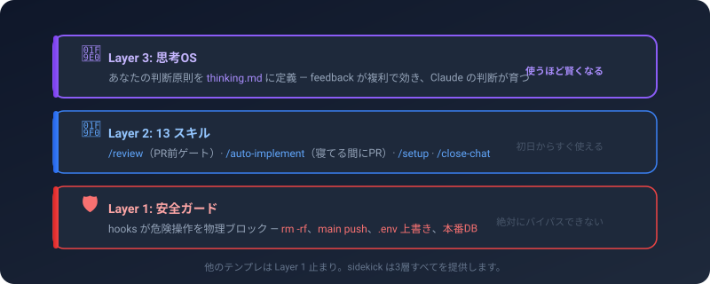
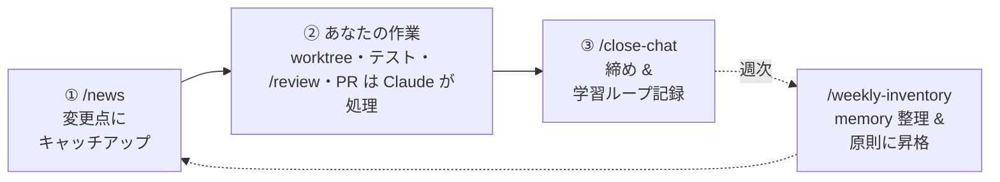
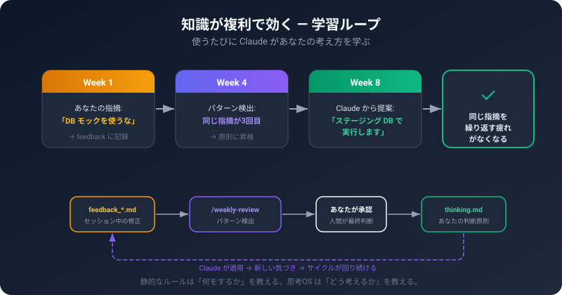
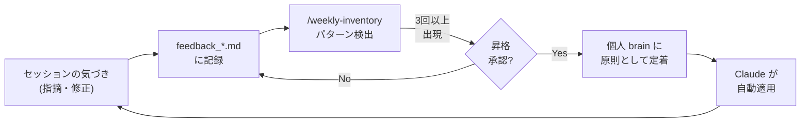
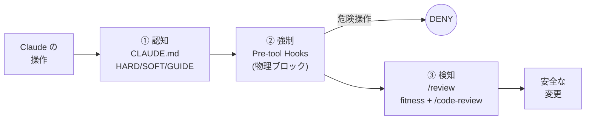
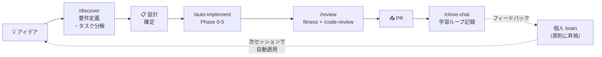
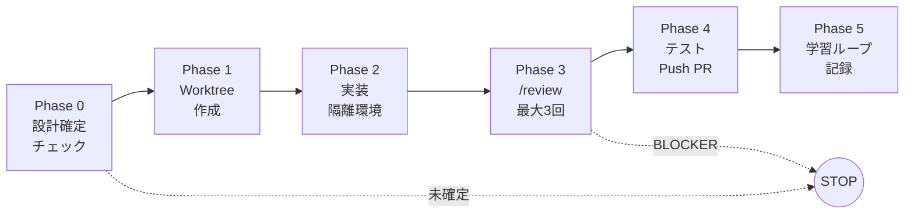

# sidekick

**Claude Code に判断を教える。そして任せる。**

[English README is here](README.md)


Claude Code を「安全に・あなたの判断軸で・自動化する」ためのリポジトリテンプレートです。
上から順に読めます: 何か → 回すループ → 仕組み。

---

## 30秒で言うと

sidekick は Claude Code の土台になる**リポジトリテンプレート**です。最初から次の3つが入っています:

| 🛡️ 安全ガード | 🧰 再利用ワークフロー | 🧠 思考OS |
|---|---|---|
| `rm -rf` や main 直 push など危険操作を**物理的にブロック** | `/discover`、`/review`、`/auto-implement` など**13スキル**が即使える | あなたの判断原則を学習し、**使うほど Claude の提案精度が上がる** |

最後の「思考OS」が sidekick の一番の差別化です。

<p align="center">
  
</p>

---

## 実際に回すループ

日々あなたが触れるのは**3つの動詞**だけ。残りは自動で動く配管で、覚える必要はありません。



| 動詞 | タイミング | やってくれること |
|---|---|---|
| **`/news`** | session 開始 | 前回からの変更点にキャッチアップ |
| **（あなたの作業）** | — | worktree 作成・スコープ限定テスト・`/review` 自己レビュー・PR 作成（マージはあなたの判断） |
| **`/close-chat`** | session 終了 | 締め、バックログ記録、フィードバックを学習ループに記録 |
| **`/weekly-inventory`** | 週次 | memory を整理し、繰り返しのフィードバックを原則に昇格 |

> **意識する面積はこれだけ。** 他のスキルは適切な瞬間に自動で呼ばれます。どれを使うか覚える必要はありません。

---

## ぶっちゃけ、何が良くなるの？

### Before（素の Claude Code）

```
あなた : 「ログインのバグ直して」
Claude : → main で直接修正
         → テストなしで完了報告
         → そのまま git push
あなた : 「...え、main が壊れてる」
```

### After（sidekick あり）

```
あなた : 「ログインのバグ直して」
Claude : → Worktree 作成（main は触らない）
         → ステージング DB に接続確認
         → 修正 → スコープ限定テスト
         → /review（fitness → 公式 /code-review + REVIEW.md → min 判定）
         → PR 作成（マージはあなたの判断）
```

**ここに、使うほど効いてくる学習ループが乗ります:**

```
セッション1: 「DB モックじゃなくステージング DB 使って」とフィードバック
セッション2: 同じ指摘（2回目を検出）
セッション3: 3回目 → 原則としてあなたの brain に昇格
セッション4以降: Claude の方から「ステージング DB で実行します」と提案
```

つまり、**毎回同じことを指摘する疲れ** がなくなります。

<p align="center">
  
</p>

---

## 他のテンプレと何が違うの？

| | 素の Claude Code | 一般的なテンプレ | **sidekick** |
|---|:---:|:---:|:---:|
| 危険操作の物理ブロック | ❌ | △（ルール記述のみ） | ✅ hooks で強制 |
| 再利用スキル | ❌ | △ | ✅ 13 種類 |
| **あなたの判断軸を学習** | ❌ | ❌ | ✅ **思考OS** |
| 完全自動実装（寝てる間に PR） | ❌ | ❌ | ✅ `/auto-implement` |
| ADR で設計判断を追跡可能 | ❌ | △ | ✅ |

**一言でいうと**、他のテンプレが「ルール集（= 静的なドキュメント）」なのに対して、sidekick は「**育つ判断軸（= 動的なシステム）**」を提供します。

<details>
<summary><b>よくある質問 — Claude Code 専用？ 個人/チーム？ 課金？ 既存PJ？</b></summary>

**Q. Claude Code 専用ですか？ Cursor / Cline / Gemini でも使える？**
はい、Claude Code 専用です。hooks / skills / settings.json のフォーマットは Claude Code 仕様です。ただし「**あなたの判断軸を AI に学習させる**」という設計思想自体は他のツールにも応用できます。

**Q. 個人開発でも使える？ チーム向け？**
両方 OK。「エンタープライズ版」は用意していません。同じ設定を規模に応じてスケールさせます（Worktree が並行作業で必須に、`/review` がチームゲートに、`PROTECTED_BRANCHES` が増えます）。

**Q. API 従量課金？ Claude Max サブスク？**
Claude Max サブスクリプション上で動きます。API 従量課金は不要。10 プロジェクト動かしても月 $100 固定。（[ADR-0003](./docs/decisions/0003-slack-cron-architecture.md)）

**Q. 既存プロジェクトに後から入れられる？**
入れられます。運用保守フェーズのプロジェクトには、**まず安全ガード（hooks）と `/review` だけ** 導入するのがおすすめ。思考OS は後から育てていけます。

</details>

---

## クイックスタート

### 入手方法

| あなたの状況 | 経路 | コマンド / アクション |
|---|---|---|
| **新規**プロジェクトを始める | GitHub テンプレート（推奨） | `gh repo create my-project --template SideMountain/claude-code-sidekick --private --clone` |
| **手元にコピー**して学習・フォークしたい | `git clone` | `git clone https://github.com/SideMountain/claude-code-sidekick.git` |
| **既存**プロジェクトに入れる | 手動オーバーレイ | `cp -r sidekick/CLAUDE.md sidekick/.claude/ your-project/` の後 `/setup` |
| 既に sidekick 導入済みで**新バージョン**が欲しい | `/adopt-sidekick-update` | プロジェクトで `/adopt-sidekick-update` を実行 |

### `/setup` を実行する

Claude Code 起動後、`/setup` を叩くと対話形式で進みます（所要 **約5分**）:

```
┌──────────────────────────────────────────────────┐
│ Step 1 : プロジェクト情報                         │
│  言語 / ORM / テストコマンド / ステージング有無   │
│  → CLAUDE.md に反映                               │
├──────────────────────────────────────────────────┤
│ Step 2 : 安全ガードを有効化                       │
│  rm -rf, .env 上書き, main 直 push をブロック     │
│  → settings.json + hooks/                         │
├──────────────────────────────────────────────────┤
│ Step 3 : テンプレート + brain 配置                │
│  CLAUDE.local.md（個人設定、gitignore 済み）      │
│  個人 brain（~/.claude/brain/thinking.md）        │
├──────────────────────────────────────────────────┤
│ Step 4 : あなたの判断原則（任意・スキップ可）     │
│  「何を最優先？ スピード / 安全性 / ユーザー影響」│
│  → 後から自然に育つ（スキップ OK）                │
└──────────────────────────────────────────────────┘
```

### 試しに一つ頼んでみる

```
「README の誤字を修正して PR 出して」
```

Claude は自動で: Worktree を作る（main は守る）→ 誤字を修正 → `/review` で自己レビュー → PR 作成（あなたがマージ）。この一連が最初の体験になります。

### Next.js + Prisma プロジェクトを立ち上げる（opt-in stack pack）

アプリが **Next.js（App Router）+ Prisma** なら、**stack pack** に opt-in すると、規定アーキ
（golden path・一貫した構造）で開発を始め、規約準拠のアプリ骨格を生成し、逸脱を CI で止められます。
非 Next.js の PJ はここを丸ごとスキップ — `STACK_PACK: none` のままで無コストです。

1. **有効化する。** `/setup` は `package.json` に `next` を検知すると案内します。**生成直後のリポは
   まだ `package.json` が無く自動検知が滑る**ので、その場合は `CLAUDE.md` で手動設定:
   `STACK_PACK: nextjs`（と `ORM_TYPE: prisma`）。
2. **契約を読む。** [`.claude/stack-packs/nextjs/ARCHITECTURE.md`](.claude/stack-packs/nextjs/ARCHITECTURE.md)
   が golden path（Tier-1 STRUCTURAL / Tier-2 HYGIENE・`grep` 検証付き）。
3. **Next.js アプリ本体を作る。** pack は**アプリを作らない** — 先に `npx create-next-app` 等で
   `next` / `react` / `zod` / `prisma` と `package.json` を用意する。
4. **golden path 骨格を scaffold:**
   ```bash
   node .claude/stack-packs/nextjs/scaffold/scaffold.js . --force   # step 3 で非空になっているため --force 必須
   ```
   規約準拠の `posts` 縦スライス（Prisma singleton・auth helper・Zod schema・DAL・Server Action・
   route handler・webhook + cron）をコピー。出力は定義上 fitness-green。
   `--force` は step 3 の create-next-app でディレクトリが非空になるため必須。`package.json` は
   **非破壊マージ**される（app name・解決済み依存バージョンを保持し、`test:arch` 等の golden path script と
   不足依存を追加）。ただし他の config（`tsconfig.json` / `next.config.ts` / `eslint.config.mjs` /
   `app/layout.tsx` / `.gitignore`）は golden path 版で**置換**されるので、scaffold 前のカスタマイズは
   再適用すること。その後 create-next-app の既定 `app/page.tsx` / `app/globals.css` は削除する
   （golden path 外・scaffold が削除を促す）。
5. **install + DB。** `<pm> install` → `.env` に `DATABASE_URL` 設定 → `npx prisma migrate dev`。
   scaffold が `prisma/schema.prisma`（`posts` モデル）を同梱するので、自分のドメインに合わせて拡張する。
6. **開発。** 新 feature ごとに `posts` スライスを**複製**する（各層の規約はファイル先頭コメントと
   `.claude/stack-packs/nextjs/scaffold/README.md`）。
7. **アーキを CI で gate する。** scaffold が `test:arch` を `package.json` に配線済み。実行する（CI にも挿す）:
   ```jsonc
   "scripts": { "test:arch": "node .claude/stack-packs/nextjs/fitness-functions/run-fitness.js ." }
   ```
   ```bash
   npm run test:arch   # error = HARD（CI を落とす）／ warn = SOFT（助言）
   ```
   （S1 の循環依存検出は zero-dep fitness の対象外 — `madge --circular` を別 CI ステップで補う。）
8. **可視化。** 同梱の `system-map` スキルで 画面↔API↔DB↔権限↔遷移 を描く。

詳細: [stack pack README](.claude/stack-packs/nextjs/README.md) ·
[scaffold](.claude/stack-packs/nextjs/scaffold/README.md) ·
[fitness-functions](.claude/stack-packs/nextjs/fitness-functions/README.md)。

---

<details>
<summary><b>🔍 仕組み（深掘り）</b></summary>

### 🧠 思考OS — あなたの判断軸を学習する

sidekick の一番の核。セッションのフィードバックが繰り返されると、**原則に昇格**し、Claude が以降自動適用するようになります。



**昇格判断は必ずあなたが確認します**（完全自動昇格ではない）。`/weekly-inventory` で候補が提示され、OK を出したものだけが brain に入ります。

#### 判断軸はどこに置かれる？ — 2層 brain（ADR-0016）

sidekick は判断軸を2つのファイルに分け、個人の原則は**あなた**について回り、プロジェクト固有のルールは**ローカル**に留まるようにします:

- **個人 brain** — `~/.claude/brain/thinking.md`: 全プロジェクト横断のあなたの判断軸（何を最優先するか、絶対にやらないこと、自分の失敗パターン）。あなたが育てる。`/adopt-sidekick-update` は決して上書きしない。
- **PJ brain** — `<project>/.claude/brain/thinking.md`: このプロジェクト固有の判断。個人 brain を1段 `@import` する。個人 brain が不在なら import は silent ignore され（フェイルセーフ）、PJ brain だけがロードされる。

リポジトリルートの `brain/thinking.md` は**テンプレート（ロード対象外）**で、`/setup` が個人 brain 不在時のみ `~/.claude/brain/thinking.md` にコピーする（既存の個人 brain は決して壊さない）。

| ファイル | 何を定義？ | 変わるタイミング |
|---|---|---|
| `~/.claude/brain/thinking.md` | **あなた**の判断原則 — 全プロジェクト横断（個人 brain） | あなたの考え方が変わったとき |
| `<project>/.claude/brain/thinking.md` | **このプロジェクト**の判断軸（PJ brain、個人 brain を `@import`） | PJ 固有の判断が変わったとき |
| `rules/*.md` | **プロジェクト**固有ルール（コーディング規約、DB、Git） | プロジェクトが変わったとき |
| `CLAUDE.md` | プロジェクト設定 + HARD/SOFT/GUIDE ルール | プロジェクトが変わったとき |

### 🛡️ 3層防御 — 安全は絶対に壊さない



| レイヤー | 仕組み | 例 |
|---|---|---|
| **① 認知** | CLAUDE.md のルール（HARD / SOFT / GUIDE） | 「main に push するな」 |
| **② 強制** | Pre-tool hooks（JSON deny = 実行されない） | `guard-bash.sh` が `rm -rf` をブロック |
| **③ 検知** | `/review` アダプタ（fitness + 公式 `/code-review` + REVIEW.md） | PR でセキュリティ問題を検出 |

**ブロックの強さ 4 段階:**

1. **deny リスト（settings.json）** — 絶対に実行されない: `prisma db push`, force push
2. **guard ブロック（hooks）** — JSON deny で止める: `rm -rf`, `.env` 変更, 保護ブランチ push, 本番 DB 操作
3. **HARD ルール** — Claude があなたに確認してから実行: `git push`（feature）, `gh pr create`, `gh pr merge`
4. **それ以外** — `Bash(*)` で自動承認（ダイアログなし）

**勝手に発火する hooks**（全インベントリ → [docs/lifecycle.ja.md](./docs/lifecycle.ja.md#強制--hooks--guards)）: `session-start.sh`（自動 ff-pull + Active Work / staleness / 未取込 critical を surface）、`prompt-reminder.sh`（毎ターン ルール再提示）、`guard-commit-message.sh`（commit 本文に 背景/対応/影響 必須）、`guard-protected-branch-edit.sh`（main での編集禁止 → worktree 強制）、そして公開ファイルへの secret/PII コミットを物理ブロックする git-native **PII pre-commit hook**。

### 🧰 13 スキル

上の3動詞（`/news`, `/close-chat`, `/weekly-inventory`）が手で実行するもの。残りは配管で、必要な瞬間に呼ばれます。

| カテゴリ | スキル | 用途 |
|---|---|---|
| **アイデア発想** | `/discover` | アイデア → 要件定義（ギャップ分析・タスク分解） |
| **レビュー** | `/review` | アダプタ: 決定的 fitness → 公式 `/code-review`（REVIEW.md 規範注入）→ min() 総合判定 |
| **ライフサイクル** | `/setup`, `/close-chat`, `/weekly-inventory`, `/news` | セッション・プロジェクト管理 |
| **健全性** | `/tune`, `/token-audit` | テスト/CI高速化・テスト棚卸し（削除せず統合/補強）・コード共通化・常駐文脈の footprint 計測とトークン肥大検知（read-only 監査→人手ゲート） |
| **ナレッジ** | `/record-decision`, `/inventory` | ADR 記録、バージョン追跡 |
| **更新・リリース** | `/adopt-sidekick-update`, `/release` | 上流の更新を取り込む / バージョン付きリリースを切る |
| **自動化** | `/auto-implement` | 実装→テスト→レビュー→PR を全自動 |

> **+1 opt-in スキル:** `system-map`（Next.js stack pack）はコードベースを単一オフライン HTML 地図に描く — 画面↔API↔DB↔権限↔遷移。[Next.js + Prisma プロジェクトを立ち上げる](#nextjs--prisma-プロジェクトを立ち上げるopt-in-stack-pack) を参照。

### 🔄 スキル同士のつながり

`/discover` と `/auto-implement` が1本のパイプラインの両端。その間は自動で流れます。



> **全体地図** — 全機能と、それが閉じるライフサイクル輪（session・知識複利・dev・release→adopt・強制・下流逆流）— は **[docs/lifecycle.ja.md](./docs/lifecycle.ja.md)** にあります。意図的に開いている輪・保守者専用の輪も明記しています。

### 🌙 自動モード — 寝てる間に PR ができる

```
あなた: 「設計 OK。/auto-implement #10, #11, #12」
Claude: → 3つの Worktree を並列作成
        → 各 Issue を独立実装
        → /review を各 PR に実行
        → push して PR を3つ作成
あなた: （朝）PR をレビュー・マージ
```

完全無人実行（夜間・離席中）:

```bash
SIDEKICK_AUTO=true claude --dangerouslySkipPermissions \
  -p "/auto-implement #10, #11, #12"
```



**自動でも人間が判断するもの:** PR の main へのマージ / DB マイグレーション / 本番デプロイ。
高度な設定（cron, Slack 連携）→ [cron-setup-guide.md](./docs/cron-setup-guide.md)

### 🗂️ アーキテクチャ

```
your-project/
├── CLAUDE.md                    # ルール・設定（HARD/SOFT/GUIDE）
├── REVIEW.md                    # PJ レビュー規範（公式 /code-review に注入）
├── brain/
│   └── thinking.md              # 個人 brain テンプレート（ロード対象外。/setup が ~/.claude/brain/ にコピー）
├── .claude/
│   ├── hooks/                   # 安全の強制層（guard-bash, db-operation, session-start, …）
│   ├── skills/                  # 13 の再利用ワークフロー
│   ├── scripts/                 # 共有の決定的検査（detect-hard-spot, …）
│   ├── brain/
│   │   └── thinking.md          # PJ brain（~/.claude/brain/thinking.md を @import）
│   ├── rules/                   # プロジェクト固有ルール（コーディング規約、DB、Git）
│   ├── docs/                    # 遅延ロード doc（worktree-guide, knowledge-reflux, …）
│   ├── templates/               # /setup が opt-in で配置するファイル
│   └── settings.json            # 権限、hooks、deny リスト
└── docs/
    └── decisions/               # ADR（設計判断記録）
```

</details>

---

## 設定

`CLAUDE.md` 冒頭の `Project Configuration` で設定:

| 設定 | 説明 | デフォルト |
|---|---|---|
| `PROJECT_NAME` | プロジェクト名 | `""` |
| `STG_ENABLED` | ステージング環境の有無 | `false` |
| `ORM_TYPE` | `prisma` / `drizzle` / `none` | `none` |
| `LANGUAGE` | `typescript` / `python` | `typescript` |
| `STACK_PACK` | opt-in な Next.js golden path: `none` / `nextjs`。scaffold + アーキ fitness + `system-map` を有効化（[stack pack](.claude/stack-packs/nextjs/README.md)） | `none` |
| `NOTION_ENABLED` | 外部タスク DB 連携 | `false` |
| `TEST_COMMAND` | テストコマンド | `""` |
| `BUILD_COMMAND` | ビルドコマンド | `""` |

---

## 設計思想

1. **知識が複利で効く**: セッションの気づきが feedback → 原則 → 思考OS に育つ。使うほど賢くなる。（[ADR-0007](./docs/decisions/0007-thinking-os-positioning.md)）
2. **安全が最優先**: ハードブロックは絶対に解除されない。auto モードでも、あなたの指示でも、巧妙な回避策でも。
3. **ブラックリスト方式**: 危険なものだけリスト化。残りは全自動。（[ADR-0002](./docs/decisions/0002-blacklist-execution-and-two-lanes.md)）
4. **固定費、PJ 比例しない**: Claude Max 上で動く。API 従量課金なし。10 PJ でも $100/月。（[ADR-0003](./docs/decisions/0003-slack-cron-architecture.md)）
5. **Git が Source of Truth**: 外部 DB 不要。CLAUDE.md + ADR + GitHub Issues + auto-memory で完結。Notion はオプション。（[ADR-0004](./docs/decisions/0004-context-consolidation-claude-code-first.md)）

> 📐 設計思想の全体像は **[`docs/design.ja.md`](./docs/design.ja.md)** に1枚でまとまっています（現行の設計を一望できるダイジェスト）。

---

## バージョン管理と更新

sidekick は **git tag + GitHub Releases** でバージョン管理します。各プロジェクトは取り込み済みバージョンを `CLAUDE.md` に記録:

```yaml
SIDEKICK_VERSION: "0.12.0"
```

`/inventory` で最新の GitHub Release と比較し、更新を確認できます。設計判断の全台帳（なぜそうなっているか）は [ADR 索引](./docs/decisions/README.md)。

### リリース温度感

リリースは3段階に分類されます（[ADR-0009](./docs/decisions/0009-release-adoption-design.md)）:

- **⚠️ [CRITICAL]**: セキュリティ / 致命的バグ修正。**即取り込み推奨**
- **(プレフィックスなし)**: Standard — 通常の機能追加・修正（デフォルト）
- **💡 [ENHANCEMENT]**: opt-in な改善。**後回し可**

温度感は Release の title と banner に出るほか、body に機械可読な `severity:` マーカーとして出力されます。`/inventory` はこのマーカー（無ければ title）を読み、緊急度を伝えます。

### 更新の受け取り方（`/adopt-sidekick-update`）

**`/adopt-sidekick-update`** で新リリースを取り込みます。対話型・カテゴリ一括方式で、対象リリースとの差分を取り、カテゴリ（rules / skills / hooks / scripts / docs）ごとにまとめて承認するか、ファイル単位で個別確認できます。見送った項目は記録され、再提案されません。

**個人 brain**（`~/.claude/brain/thinking.md`）は決して自動上書きされません — テンプレート側の更新は、あなたが承認する差分として提示されます（ADR-0016）。

典型フロー: `/inventory`（差分 + 温度感を検出）→ `/adopt-sidekick-update`（適用）→ `SIDEKICK_VERSION` 更新。

---

## フィードバック

sidekick を使っていて「ここが良い」「困った」「こうして欲しい」があれば、
[Downstream Feedback](https://github.com/SideMountain/claude-code-sidekick/issues/new?template=downstream-feedback.yml)・
[Bug Report](https://github.com/SideMountain/claude-code-sidekick/issues/new?template=bug-report.yml)・
[Feature Request](https://github.com/SideMountain/claude-code-sidekick/issues/new?template=feature-request.yml) のいずれかへ。

一方通行ではありません: 立てた Issue は保守者の `/inventory`（`gh issue list`）に surface → backlog に整理 → `/release` で出荷 → `/inventory` + `/adopt-sidekick-update` であなたに戻る。これが下流逆流ループの閉じ方です。

## ライセンス

MIT
