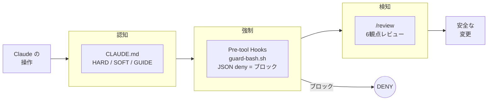
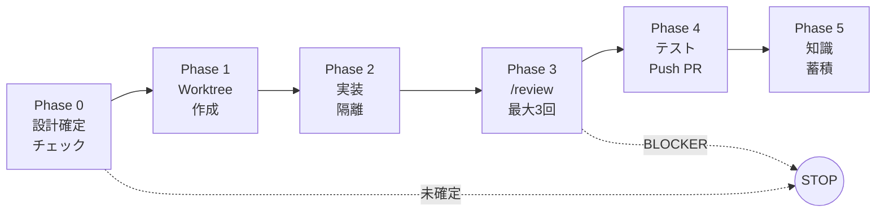

# sidekick

**Claude に判断を教える。そして任せる。**

あなたの判断原則がエンコードされ、複利で効いていく。安全フックがミスを防ぎ、スキルがワークフローを自動化する。でも sidekick が本当に違うのは、**使うたびに AI があなたの考え方を学ぶ**こと。

---

## sidekick は何が違うのか

他の Claude Code テンプレートはルールを渡す。sidekick は**思考OS** を渡す ― `thinking.md` という入れ替え可能な「脳」が、Claude の判断を決める。

```
Week 1:  「テストでDBモックを使うな」と伝える
Week 4:  パターン検出 → thinking.md の原則に昇格
Week 8:  Claude の方から「テスト原則に基づいて、
         ステージングDBを使うべきです」と提案してくる
```

これは単なる記憶ではない。**複利で効く成長サイクル**:

```
セッション中の feedback → feedback_*.md → パターン検出 → thinking.md §1 → Claude の判断が変わる
                                          (/weekly-review)
```

### 思考OS はあなた専用にカスタマイズできる

`thinking.md` §1 はオーナーの判断原則を定義する。自分の軸に置き換えられる:

- 何を最優先するか（スピード？安全性？ユーザー影響？）
- 絶対にやらないこと（過剰設計？テスト省略？金曜デプロイ？）
- 自分の失敗パターン（どこで判断を間違えがちか）

フレームワーク（セルフレビュー、フェーズ別プロトコル、コミュニケーション）はそのまま。**判断軸だけがプラガブル。**

---

## なぜ sidekick が必要か？

Claude Code はそのままだと強力だが危険。一つの間違いで本番に push、テーブルを DROP、`.env` を上書きしうる。

sidekick は3つのレイヤーでこれを解決する:

```
レイヤー1: 安全       → hooks が危険な操作を物理ブロック
レイヤー2: スキル     → 再利用可能なワークフロー（レビュー、セットアップ、自動実装）
レイヤー3: 思考       → あなたの判断原則 → feedback → 成長（思考OS）
```

### sidekick なし

```
あなた: 「ログインのバグ直して」
Claude: *.env を変更* *main に push* *テストデータ消去*
あなた: 「...」
```

### sidekick あり

```
あなた: 「ログインのバグ直して」
Claude: → Worktree 作成（main は触らない）
        → DB 接続先確認（ステージング確認済み）
        → 修正 → スコープ限定テスト実行
        → /review（コード + テスト + 運用）
        → PR 作成（マージはあなたの判断）
```

---

## クイックスタート

### 新規プロジェクト（テンプレートから）

```bash
# 1. テンプレートからリポジトリ作成
gh repo create my-project --template SideMountain/claude-code-sidekick

# 2. セットアップ
cd my-project
claude  # /setup を実行
```

### 既存プロジェクトに導入

```bash
# 1. コアファイルをコピー
cp -r sidekick/CLAUDE.md sidekick/.claude/ your-project/

# 2. 設定 — /setup が残り（MEMORY.md, .gitignore, テンプレート）を全て処理
cd your-project && claude  # /setup を実行
```

**Tip**: 運用保守フェーズのプロジェクトには、まず安全ガード（hooks + HARDルール）と `/review` だけ導入するのがおすすめ。

---

## 仕組み

### 思考OS: あなたの判断軸で、Claude が動く

`thinking.md` は `.claude/rules/thinking.md` に配置される ― 他のルールファイルとは役割が違う。プロジェクトルールではなく**オーナーの判断軸**。「人」に紐づくから、プロジェクトを跨いで持ち運べる。

| ファイル | 定義するもの | 変わるタイミング |
|---------|------------|---------------|
| `thinking.md` | オーナーの判断原則、セルフレビュー手順 | あなたの考え方が変わったとき |
| `rules/*.md` | プロジェクト固有ルール（コーディング、DB、Git、デプロイ） | プロジェクトが変わったとき |
| `CLAUDE.md` | プロジェクト設定 + HARD/SOFT/GUIDE ルール | プロジェクトが変わったとき |

### 知識パイプライン: セッションが原則になるまで

```
セッション1: 「テストでDBモックを使うな」
  → feedback_testing.md に保存

セッション2: 「結合テストもリアルDB使って」
  → feedback_testing.md（2回目）

セッション3: 「ステージングDBで必ずテストしろ」
  → 3回目を検出 → thinking.md §1 に昇格

以降: Claude が原則として自動適用
```

### セッションライフサイクル

```
/setup          → プロジェクト初期化 + thinking.md のカスタマイズ
  ↓ (開発)
/close-chat     → 判断を記録、知識還流フラグを付与
  ↓ (蓄積)
/weekly-review  → feedback を圧縮、パターンを thinking.md に昇格
  ↓ (成長)
thinking.md     → Claude の提案精度が上がっていく
```

### 安全: 3層防御



| レイヤー | 仕組み | 例 |
|---------|--------|-----|
| **認知** | CLAUDE.md ルール（HARD/SOFT/GUIDE） | 「main に push するな」 |
| **強制** | Pre-tool hooks（JSON deny = ブロック） | `guard-bash.sh` が `rm -rf` をブロック |
| **検知** | `/review` スキル（6観点） | PR でセキュリティ問題を検出 |

**deny リスト**（絶対に実行されない — settings.json でブロック）:
- `prisma db push`、force push

**guard ブロック**（hooks が JSON `permissionDecision: "deny"` でブロック）:
- `rm -rf`、`.env` 変更、保護ブランチへの push、本番DB操作

**HARD ルール**（Claude がユーザーに確認してから実行）:
- `git push`（feature ブランチ）、`gh pr create`、`gh pr merge`

**それ以外** — `Bash(*)` で自動承認。ダイアログなし。

### スキル: 14の再利用ワークフロー

| カテゴリ | スキル | 用途 |
|---------|--------|------|
| **レビュー** | `/review`, `/review-code`, `/review-test`, `/review-ops`, `/review-design`, `/review-spec` | 変更スコープに応じて動的に必要な観点だけ実行 |
| **ライフサイクル** | `/setup`, `/close-chat`, `/weekly-review`, `/news` | セッション・プロジェクト管理 |
| **ナレッジ** | `/record-decision`, `/inventory` | ADR記録、バージョン追跡 |
| **自動化** | `/auto-implement` | 実装→テスト→レビュー→PR を全自動 |

### 自動モード: 寝てる間に PR ができる

```
あなた: 「設計OKだね。/auto-implement #10, #11, #12」
Claude: → 3つの Worktree を並列作成
        → 各 Issue を独立実装
        → /review を各PRに実行
        → push して PR を3つ作成
        → 知識還流 + バックログも自動蓄積
あなた: *朝に PR をレビュー・マージ*
```

完全無人実行（夜間・離席中）:
```bash
SIDEKICK_AUTO=true claude --dangerouslySkipPermissions \
  -p "/auto-implement #10, #11, #12"
```

**`/auto-implement` パイプライン:**



**朝起きて見るレポート:**

```
=== /auto-implement 完了レポート（並列3件） ===

[全体結果] 2件成功 / 1件停止

-- Issue #10: ユーザー認証 -- OK
  [PR] #43
  変更: 8ファイル（+342, -28）
  テスト: 156 passed / レビュー: OK（Ops WARN 1件 → 修正済み）
  知識還流: 1件 / バックログ: 2件

-- Issue #11: メール通知テンプレ -- OK
  [PR] #44
  変更: 4ファイル（+89, -12）
  テスト: 160 passed / レビュー: OK

-- Issue #12: 管理画面ダッシュボード -- STOPPED
  [停止Phase] Phase 3（レビュー）
  [停止理由] BLOCKER: N+1クエリ（lib/dashboard.ts L45）
  [再開方法] N+1 修正後、/auto-implement #12 で再実行

-- 次のアクション --
  → PR #43, #44 をレビュー・マージ
  → Issue #12 は対話モードで N+1 修正、または修正後に再実行
==========================================================
```

**自動でも人間が判断するもの:**
- PR の main へのマージ
- DB マイグレーション
- 本番デプロイ

高度な設定（cron、Slack連携）は [cron-setup-guide.md](docs/cron-setup-guide.md) を参照。

---

## アーキテクチャ

```
sidekick/
├── CLAUDE.md                    # ルール・設定（HARD/SOFT/GUIDE）
├── .claude/
│   ├── hooks/                   # 安全の強制層
│   │   ├── guard-bash.sh        # 9ガード（push, rm, prisma, env 等）
│   │   ├── guard-commit-message.sh
│   │   ├── guard-db-operation.sh
│   │   ├── guard-protected-branch-edit.sh
│   │   ├── prompt-reminder.sh
│   │   └── session-start.sh
│   ├── skills/                  # 14の再利用ワークフロー
│   │   ├── review/              # オーケストレーター + agents/ + references/
│   │   ├── auto-implement/      # 全自動パイプライン
│   │   ├── close-chat/          # セッション締め + 知識還流
│   │   └── ...
│   ├── rules/                   # ガイドライン + 思考OS
│   │   ├── thinking.md          # 思考OS — オーナーの判断原則（入れ替え可能）
│   │   ├── knowledge-map.md     # 知識の配置先マップ
│   │   ├── code-quality.md      # コーディング規約
│   │   └── ...
│   ├── templates/               # /setup が opt-in で配置するファイル
│   │   ├── MEMORY.md            # セッション記憶テンプレート
│   │   ├── CLAUDE.local.md      # 個人設定テンプレート
│   │   └── github/              # GitHub Issue テンプレート・ラベル定義
│   ├── docs/                    # 開発者リファレンス（毎セッション読み込まない）
│   │   └── skill-agent-design.md
│   └── settings.json            # 権限、hooks、deny リスト
├── docs/
│   ├── decisions/               # ADR（設計判断記録）
│   ├── cron-setup-guide.md      # 自動実行ガイド
│   └── playwright-setup-guide.md
└── .github/                     # sidekick リポ自身用（下流には伝播しない）
    ├── ISSUE_TEMPLATE/
    └── labels.yml
```

---

## 設定

`CLAUDE.md` 冒頭の `Project Configuration` で設定:

| 設定 | 説明 | デフォルト |
|------|------|----------|
| `PROJECT_NAME` | プロジェクト名 | `""` |
| `STG_ENABLED` | ステージング環境 | `false` |
| `ORM_TYPE` | `prisma` / `drizzle` / `none` | `none` |
| `LANGUAGE` | `typescript` / `python` | `typescript` |
| `NOTION_ENABLED` | 外部タスクDB連携 | `false` |
| `TEST_COMMAND` | テストコマンド | `""` |
| `BUILD_COMMAND` | ビルドコマンド | `""` |

### スケーリング: 個人 → チーム

sidekick は個人開発者でも小チームでも使える。「エンタープライズ版」は不要。

| 設定 | 個人 | チーム |
|------|------|--------|
| Worktree | 任意 | 必須（並行作業） |
| `/review` | セルフレビュー | チームレビューゲート |
| `PROTECTED_BRANCHES` | `main` | `main`, `release/stg` |
| MEMORY.md | 個人メモ | 共有コンテキスト |

---

## 設計思想

1. **知識が複利で効く**: セッションの気づきが feedback → 原則 → 思考OS に育つ。使うほど賢くなる。([ADR-0007](docs/decisions/0007-thinking-os-positioning.md))

2. **安全が最優先**: ハードブロックは絶対に解除されない。autoモードでも、ユーザーの指示でも、巧妙な回避策でも。

3. **ブラックリスト方式**: 危険なものだけリスト化。残りは全自動。([ADR-0002](docs/decisions/0002-blacklist-execution-and-two-lanes.md))

4. **固定費、PJ比例しない**: Claude Max サブスクリプション上で動く。API 従量課金なし。10 PJ でも $100/月。([ADR-0003](docs/decisions/0003-slack-cron-architecture.md))

5. **Git が Source of Truth**: 外部DB不要。MEMORY.md + ADR + GitHub Issues で完結。Notion はオプション。([ADR-0004](docs/decisions/0004-context-consolidation-claude-code-first.md))

---

## フィードバック

sidekick を使っていて「ここが良い」「ここが困る」「これが欲しい」があれば、[Downstream Feedback](../../issues/new?template=downstream-feedback.yml) から教えてください。

## バージョン管理

sidekick は **git tag + GitHub Releases** でバージョン管理する。プロジェクトルートに VERSION ファイルは置かない。

各プロジェクトの `MEMORY.md` に取り込み済みバージョンを記録:
```markdown
<!-- sidekick_version: 0.3.0 -->
```
`/inventory` で最新の GitHub Release と比較し、更新を確認できる。

## ライセンス

MIT

<!-- sidekick_version: 0.3.0 -->
