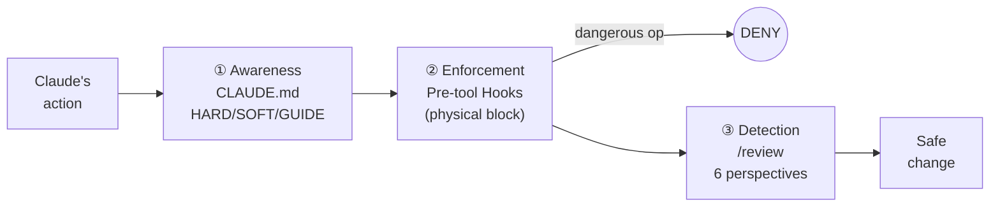
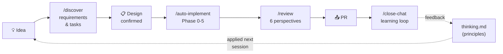
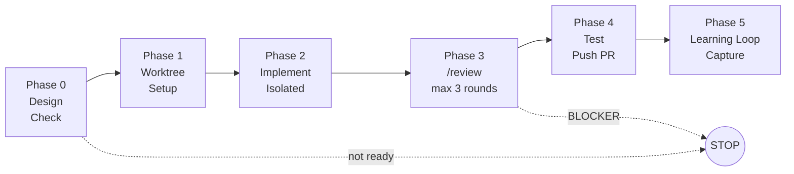

# sidekick

**Teach Claude Code your decision-making. Then hand off.**

[日本語版 README はこちら](README.ja.md)


A repository template that makes Claude Code **safe, personalized, and autonomous**.
Organized as: 30-second overview → try it → deep dive.

---

## In 30 seconds

sidekick is a **repository template** for Claude Code. It ships with three layers built in:

| 🛡️ Safety Guards | 🧰 Reusable Workflows | 🧠 Thinking OS |
|---|---|---|
| **Physically blocks** dangerous ops like `rm -rf` or pushing to main | **15 skills** ready to use: `/discover`, `/review`, `/auto-implement`, etc. | Learns your decision principles — **Claude's proposals improve over time** |

The "Thinking OS" is what sets sidekick apart from other templates.

<p align="center">
  
</p>

**How Layer 3 (Thinking OS) grows:**

<p align="center">
  
</p>

---

## What actually gets better?

### Before (vanilla Claude Code)

```
You   : "Fix the login bug"
Claude: → Edits directly on main
        → Reports "done" with no tests
        → Runs git push
You   : "...main is broken"
```

### After (with sidekick)

```
You   : "Fix the login bug"
Claude: → Creates worktree (main untouched)
        → Confirms staging DB connection
        → Fixes → Runs scoped tests
        → /review (code + test + ops — 6 perspectives)
        → Creates PR (merging is your call)
```

**On top of that, a learning loop compounds over time:**

```
Session 1: "Use staging DB, not mocks" — you give feedback
Session 2: Same feedback (2nd occurrence detected)
Session 3: 3rd time → promoted to a principle in thinking.md
Session 4+: Claude proactively says "Running against staging DB"
```

In other words, **you stop repeating yourself**.

---

## How is this different from other templates?

| | Vanilla Claude Code | Typical template | **sidekick** |
|---|:---:|:---:|:---:|
| Physically blocks dangerous ops | ❌ | △ (rules only) | ✅ hooks enforce |
| Reusable skills | ❌ | △ | ✅ 15 skills |
| **Learns your judgment** | ❌ | ❌ | ✅ **Thinking OS** |
| Fully autonomous implementation | ❌ | ❌ | ✅ `/auto-implement` |
| Tracks design decisions (ADR) | ❌ | △ | ✅ |

**In short**: other templates give you a ruleset (static docs). sidekick gives you a **growing judgment system (dynamic)**.

---

## FAQ

<details>
<summary><b>Q. Claude Code only? Does it work with Cursor / Cline / Gemini?</b></summary>

**Yes, Claude Code only.**

- hooks / skills / settings.json use Claude Code's format
- Won't work with Cursor / Cline / Gemini

That said, the core idea — **teaching your judgment to an AI** — is tool-agnostic.
</details>

<details>
<summary><b>Q. Solo dev or team?</b></summary>

**Both.** No "enterprise edition." Same config scales with your team size.

| Setting | Solo | Team |
|---|---|---|
| Worktree | Optional | Essential (parallel work) |
| `/review` | Self-review | Team review gate |
| `PROTECTED_BRANCHES` | `main` | `main`, `release/stg` |
| auto-memory | Personal notes (individual) | Individual per teammate |
</details>

<details>
<summary><b>Q. API billing? Claude Max?</b></summary>

**Runs on Claude Max subscription.** No API charges. 10 projects for the same $100/month. ([ADR-0003](./docs/decisions/0003-slack-cron-architecture.md))
</details>

<details>
<summary><b>Q. Can I add it to an existing project?</b></summary>

**Yes.** For projects in maintenance mode, start with **just safety guards (hooks) and `/review`**. The thinking OS grows naturally over time.
</details>

---

## Quick Start

### 1. Create from template

```bash
gh repo create my-project --template SideMountain/claude-code-sidekick --private --clone
cd my-project
claude
```

Adding to an existing project:

```bash
cp -r sidekick/CLAUDE.md sidekick/.claude/ your-project/
cd your-project && claude
```

### 2. Run `/setup`

After launching Claude Code, run `/setup`. It walks you through interactively (~**5 minutes**):

```
┌───────────────────────���──────────────────────────┐
│ Step 1 : Project info                            │
│  Language / ORM / test command / staging toggle   │
│  → written to CLAUDE.md                          │
├────────────────��───────────────────────────────���─┤
│ Step 2 : Activate safety guards                  │
│  Block rm -rf, .env overwrites, push to main     │
│  → settings.json + hooks/                        │
├────────────────────────────────────────��─────────┤
│ Step 3 : Deploy templates                        │
│  CLAUDE.local.md (personal config, gitignored)   │
│  (Session memory uses auto-memory, not a file)   │
├───────────��─────────────────────────────────���────┤
│ Step 4 : Your judgment principles (optional)     │
│  "Top priority? Speed / safety / user impact"    │
│  "What do you never do?"                         │
│  → written to thinking.md (fine to skip — grows  │
│    naturally over time)                          │
└──────────────────���────────────────────────────��──┘
```

### 3. Try it out

```
"Fix the typo in README and create a PR"
```

With sidekick, Claude will automatically:

1. Create a worktree (main stays safe)
2. Fix the typo
3. Self-review with `/review`
4. Create a PR → you merge

That's your first taste.

---

## How It Works

### 🧠 Thinking OS — Claude learns your judgment

The core of sidekick. When session feedback repeats, it gets **promoted to a principle** that Claude follows automatically.


**Promotion always requires your approval** (not fully automatic). `/weekly-inventory` surfaces candidates; only what you approve enters `thinking.md`.

#### What goes in `thinking.md`?

`thinking.md` §1 is your personal judgment axis:

- What you prioritize (speed / safety / user impact)
- What you never do (over-engineer / skip tests / deploy on Fridays)
- Your failure patterns (where you tend to misjudge)

The framework (self-review protocol, phase protocols) stays shared. **Only the judgment axis becomes yours.**

#### File responsibilities

| File | Defines | Changes when... |
|---|---|---|
| `thinking.md` | **Your** decision principles (tied to you, portable across projects) | Your thinking changes |
| `rules/*.md` | **Project** rules (coding standards, DB, Git strategy) | The project changes |
| `CLAUDE.md` | Project config + HARD/SOFT/GUIDE rules | The project changes |

### 🛡️ Three-layer defense — safety is non-negotiable



| Layer | Mechanism | Example |
|---|---|---|
| **① Awareness** | CLAUDE.md rules (HARD / SOFT / GUIDE) | "Don't push to main" |
| **② Enforcement** | Pre-tool hooks (JSON deny = blocked) | `guard-bash.sh` blocks `rm -rf` |
| **③ Detection** | `/review` skill (6 perspectives) | Catches security issues in PR |

**Four levels of blocking:**

1. **Deny list (settings.json)** — never runs: `prisma db push`, force push
2. **Guard blocks (hooks)** — JSON deny: `rm -rf`, `.env` changes, protected branch push, prod DB ops
3. **HARD rules** — Claude asks you first: `git push` (feature), `gh pr create`, `gh pr merge`
4. **Everything else** — auto-approved via `Bash(*)` (no dialogs)

### 🧰 15 Skills — ready-to-use workflows

| Category | Skills | Purpose |
|---|---|---|
| **Ideation** | `/discover` | Idea → requirements (gap analysis, task breakdown) |
| **Review** | `/review`, `/review-code`, `/review-test`, `/review-ops`, `/review-design`, `/review-spec` | Runs only relevant perspectives based on change scope |
| **Lifecycle** | `/setup`, `/close-chat`, `/weekly-inventory`, `/news` | Session & project management |
| **Knowledge** | `/record-decision`, `/inventory` | ADR recording, version tracking |
| **Automation** | `/auto-implement` | Full auto: implement → test → review → PR |

<sub>* `/sync-oss` is an internal skill for sidekick maintainers (not intended for downstream projects) and is omitted from this table.</sub>

### 🔄 How the skills connect

`/discover` and `/auto-implement` are the two ends of one pipeline. Everything between happens automatically.



**What this means in practice:**

- Vague idea? → `/discover` structures it into a design and a task list
- Design confirmed? → `/auto-implement` runs the full pipeline to PR
- Feedback during a session → captured by `/close-chat`, promoted to `thinking.md` by `/weekly-inventory`
- Next session starts sharper — the loop closes

### 🌙 Auto mode — PRs while you sleep

```
You   : "Design looks good. /auto-implement #10, #11, #12"
Claude: → Creates 3 worktrees in parallel
        → Implements each issue independently
        → Runs /review on each
        → Pushes and creates 3 PRs
        → Records to learning loop
You   : (morning) Review and merge PRs
```

Fully unattended (overnight, AFK):

```bash
SIDEKICK_AUTO=true claude --dangerouslySkipPermissions \
  -p "/auto-implement #10, #11, #12"
```



**What you see in the morning:**

```
=== /auto-implement report (3 parallel) ===
[Overall] 2 succeeded / 1 stopped

-- Issue #10: User auth -- OK
  [PR] #43 / Changes: 8 files (+342, -28)
  Tests: 156 passed / Review: OK (1 Ops WARN -> fixed)
  Learning loop: 1 flag / Backlog: 2 items

-- Issue #11: Email templates -- OK
  [PR] #44 / Changes: 4 files (+89, -12)
  Tests: 160 passed / Review: OK

-- Issue #12: Dashboard -- STOPPED
  [Stopped at] Phase 3 (review)
  [Reason] BLOCKER: N+1 query (lib/dashboard.ts L45)
  [Resume] Fix N+1 -> re-run /auto-implement #12

-- Next actions --
  -> Review & merge PR #43, #44
  -> Fix #12's N+1 in interactive mode
==========================================================
```

**Always manual, even in auto mode:** PR merge to main / DB migrations / production deploys

Advanced setup (cron, Slack) → [cron-setup-guide.md](./docs/cron-setup-guide.md)

---

## Configuration

Set in `Project Configuration` at the top of `CLAUDE.md`:

| Setting | Description | Default |
|---|---|---|
| `PROJECT_NAME` | Project name | `""` |
| `STG_ENABLED` | Staging environment | `false` |
| `ORM_TYPE` | `prisma` / `drizzle` / `none` | `none` |
| `LANGUAGE` | `typescript` / `python` | `typescript` |
| `NOTION_ENABLED` | External task DB integration | `false` |
| `TEST_COMMAND` | Test runner command | `""` |
| `BUILD_COMMAND` | Build command | `""` |

---

## Design Principles

1. **Knowledge compounds**: Session insights flow from feedback → principles → thinking OS. Your AI gets better every week. ([ADR-0007](./docs/decisions/0007-thinking-os-positioning.md))
2. **Safety is non-negotiable**: Hard blocks are never overridden. Not by auto mode, not by user request, not by clever workarounds.
3. **Blacklist over whitelist**: Only dangerous things are listed. Everything else runs automatically. ([ADR-0002](./docs/decisions/0002-blacklist-execution-and-two-lanes.md))
4. **Fixed cost, not per-project**: Runs on Claude Max. No API charges. 10 projects for the same $100/month. ([ADR-0003](./docs/decisions/0003-slack-cron-architecture.md))
5. **Git is the source of truth**: No external DB required. CLAUDE.md + ADR + GitHub Issues + auto-memory. Notion is optional. ([ADR-0004](./docs/decisions/0004-context-consolidation-claude-code-first.md))

---

<details>
<summary><b>Architecture Details</b></summary>

```
sidekick/
├── CLAUDE.md                    # Rules & config (HARD/SOFT/GUIDE)
├── .claude/
│   ├── hooks/                   # Safety enforcement layer
│   │   ├── guard-bash.sh        # 9 guards (push, rm, prisma, env, etc.)
│   │   ├── guard-commit-message.sh
│   │   ├── guard-db-operation.sh
│   │   ├── guard-protected-branch-edit.sh
│   │   ├── prompt-reminder.sh
│   │   └── session-start.sh
│   ├── skills/                  # 15 reusable workflows
│   │   ├── review/              # Orchestrator + agents/ + references/
│   │   ├── auto-implement/      # Full automation pipeline
│   │   ├── close-chat/          # Session wrap-up + learning loop capture
│   │   └── ...
│   ├── rules/                   # Guidelines + thinking OS
│   │   ├── thinking.md          # Thinking OS — your decision principles (pluggable)
│   │   ├── knowledge-map.md     # Where knowledge goes
│   │   ├── code-quality.md      # Coding standards
│   │   └── ...
│   ├── templates/               # Opt-in files deployed by /setup
│   │   ├── CLAUDE.local.md      # Personal config template
│   │   └── github/              # GitHub Issue templates & labels
│   ├── docs/                    # Developer reference
│   │   └── skill-agent-design.md
│   └── settings.json            # Permissions, hooks, deny list
├── docs/
│   ├── decisions/               # Architecture Decision Records
│   ├── cron-setup-guide.md      # Automation guide
│   └── playwright-setup-guide.md
└── .github/                     # For this repo only
    ├── ISSUE_TEMPLATE/
    └── labels.yml
```

</details>

---

## Feedback

Using sidekick? Tell us what works, what doesn't, and what's missing.

File a [Downstream Feedback issue](https://github.com/SideMountain/claude-code-sidekick/issues/new?template=downstream-feedback.yml) — it helps improve the template for everyone.

## Versioning

sidekick uses **git tags + GitHub Releases** for version management. No VERSION file in your project root.

Each downstream project tracks its adopted version in `CLAUDE.md` Project Configuration:

```yaml
SIDEKICK_VERSION: "0.4.1"
```

Run `/inventory` to check for updates against the latest GitHub Release.

### Release severity

Releases are classified into 3 severity levels ([ADR-0009](./docs/decisions/0009-release-adoption-design.md)):

- **⚠️ [CRITICAL]**: Security / critical bug fix. Immediate adoption recommended.
- **(No prefix)**: Standard — normal feature/fix release (default).
- **💡 [ENHANCEMENT]**: Opt-in improvements. Safe to defer.

The severity is shown in the GitHub Release title prefix and body banner. `/inventory` uses this to signal urgency. Releases are cut via the `/release` skill, which ensures release notes include machine-generated lists of changed ADRs, rules, and skills (no missed design intent).

## License

MIT

