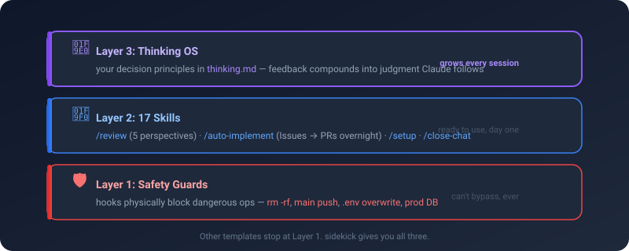
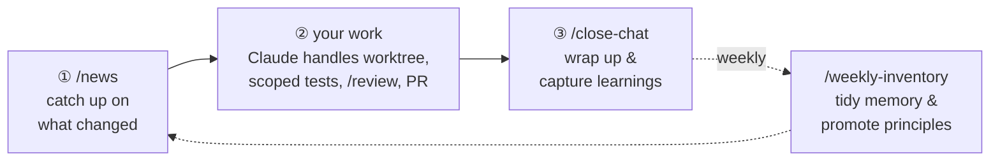
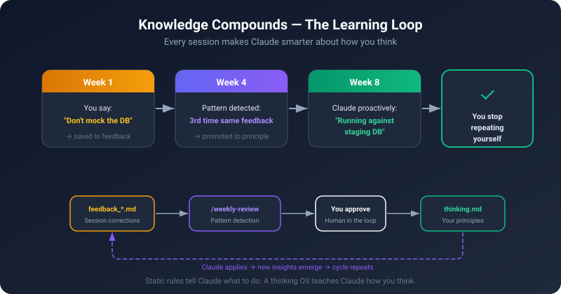
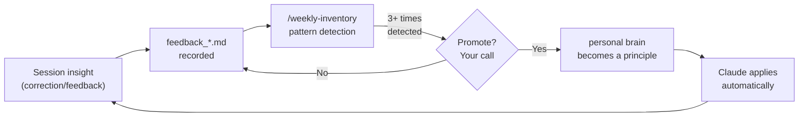
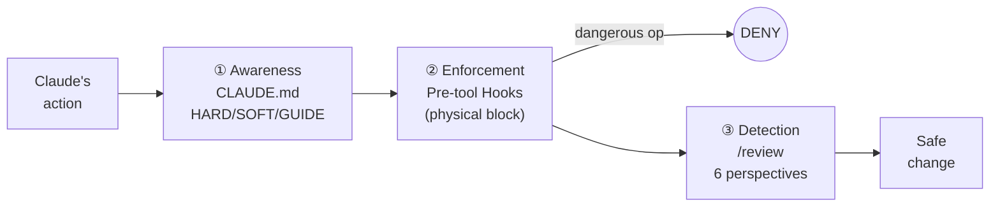
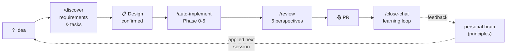
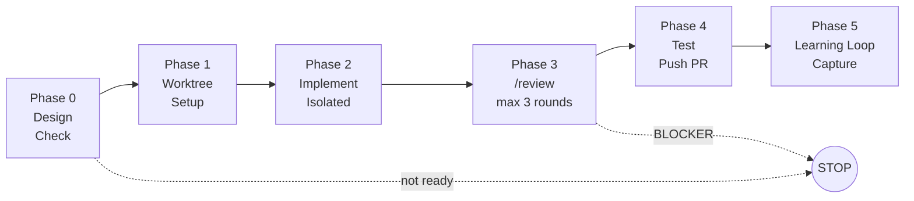

# sidekick

**Teach Claude Code your decision-making. Then hand off.**

[日本語版 README はこちら](README.ja.md)


A repository template that makes Claude Code **safe, personalized, and autonomous**.
Read it top to bottom: what it is → the loop you run → how it works under the hood.

---

## In 30 seconds

sidekick is a **repository template** for Claude Code. It ships with three layers built in:

| 🛡️ Safety Guards | 🧰 Reusable Workflows | 🧠 Thinking OS |
|---|---|---|
| **Physically blocks** dangerous ops like `rm -rf` or pushing to main | **17 skills** ready to use: `/discover`, `/review`, `/auto-implement`, etc. | Learns your decision principles — **Claude's proposals improve over time** |

The "Thinking OS" is what sets sidekick apart from other templates.

<p align="center">
  
</p>

---

## The loop you actually run

Day to day, you only touch **three verbs**. Everything else is plumbing that fires on its own — you don't memorize it.



| Verb | When | What it does for you |
|---|---|---|
| **`/news`** | Start of a session | Brings you up to speed on what changed since last time |
| **(your work)** | — | Claude creates the worktree, runs scoped tests, self-reviews with `/review`, opens the PR — merging stays your call |
| **`/close-chat`** | End of a session | Wraps up, files the backlog, captures feedback into the learning loop |
| **`/weekly-inventory`** | Weekly | Tidies memory and promotes repeated feedback into principles |

> **That's the whole surface area.** The other skills are called for you at the right moment — you never have to remember which one to run.

---

## What actually gets better?

### Before (vanilla Claude Code)

```
You   : "Fix the login bug"
Claude: → Edits directly on main
        → Reports "done" with no tests
        → Runs git push
You   : "...main is broken"
```

### After (with sidekick)

```
You   : "Fix the login bug"
Claude: → Creates worktree (main untouched)
        → Confirms staging DB connection
        → Fixes → Runs scoped tests
        → /review (code + test + ops — 6 perspectives)
        → Creates PR (merging is your call)
```

**On top of that, a learning loop compounds over time:**

```
Session 1: "Use staging DB, not mocks" — you give feedback
Session 2: Same feedback (2nd occurrence detected)
Session 3: 3rd time → promoted to a principle in your brain
Session 4+: Claude proactively says "Running against staging DB"
```

In other words, **you stop repeating yourself.**

<p align="center">
  
</p>

---

## How is this different from other templates?

| | Vanilla Claude Code | Typical template | **sidekick** |
|---|:---:|:---:|:---:|
| Physically blocks dangerous ops | ❌ | △ (rules only) | ✅ hooks enforce |
| Reusable skills | ❌ | △ | ✅ 17 skills |
| **Learns your judgment** | ❌ | ❌ | ✅ **Thinking OS** |
| Fully autonomous implementation | ❌ | ❌ | ✅ `/auto-implement` |
| Tracks design decisions (ADR) | ❌ | △ | ✅ |

**In short**: other templates give you a ruleset (static docs). sidekick gives you a **growing judgment system (dynamic)**.

<details>
<summary><b>FAQ — Claude Code only? Solo or team? API billing? Existing projects?</b></summary>

**Q. Claude Code only? Does it work with Cursor / Cline / Gemini?**
Yes, Claude Code only — hooks / skills / settings.json use Claude Code's format. That said, the core idea — **teaching your judgment to an AI** — is tool-agnostic.

**Q. Solo dev or team?**
Both. No "enterprise edition." The same config scales with your team size (Worktree becomes essential for parallel work; `/review` becomes a team gate; `PROTECTED_BRANCHES` grows).

**Q. API billing? Claude Max?**
Runs on the Claude Max subscription — no API charges. 10 projects for the same $100/month. ([ADR-0003](./docs/decisions/0003-slack-cron-architecture.md))

**Q. Can I add it to an existing project?**
Yes. For projects in maintenance mode, start with **just safety guards (hooks) and `/review`**. The Thinking OS grows naturally over time.

</details>

---

## Quick Start

### How to get it

| You are... | Path | Command / Action |
|---|---|---|
| Starting a **brand-new** project | GitHub template (recommended) | `gh repo create my-project --template SideMountain/claude-code-sidekick --private --clone` |
| Want a **local copy** to study or fork | `git clone` | `git clone https://github.com/SideMountain/claude-code-sidekick.git` |
| Adding to an **existing** project | Manual overlay | `cp -r sidekick/CLAUDE.md sidekick/.claude/ your-project/`, then run `/setup` |
| Already on sidekick, want a **newer version** | `/adopt-sidekick-update` | run `/adopt-sidekick-update` in the project |

### Then run `/setup`

After launching Claude Code, run `/setup`. It walks you through interactively (~**5 minutes**):

```
┌──────────────────────────────────────────────────┐
│ Step 1 : Project info                            │
│  Language / ORM / test command / staging toggle   │
│  → written to CLAUDE.md                          │
├──────────────────────────────────────────────────┤
│ Step 2 : Activate safety guards                  │
│  Block rm -rf, .env overwrites, push to main     │
│  → settings.json + hooks/                        │
├──────────────────────────────────────────────────┤
│ Step 3 : Deploy templates + brain                │
│  CLAUDE.local.md (personal config, gitignored)   │
│  Personal brain (~/.claude/brain/thinking.md)    │
├──────────────────────────────────────────────────┤
│ Step 4 : Your judgment principles (optional)     │
│  "Top priority? Speed / safety / user impact"    │
│  → grows naturally over time (fine to skip)      │
└──────────────────────────────────────────────────┘
```

### Try it

```
"Fix the typo in README and create a PR"
```

Claude will automatically: create a worktree (main stays safe) → fix the typo → self-review with `/review` → open a PR for you to merge. That's your first taste.

### Building a Next.js + Prisma project (opt-in stack pack)

If your app is **Next.js (App Router) + Prisma**, opt into the **stack pack** to start on a
prescriptive *golden path* (consistent architecture), generate a conforming app skeleton, and gate
deviations in CI. Non-Next.js projects skip this entirely — leave `STACK_PACK: none` (zero cost).

1. **Enable it.** `/setup` offers this when it detects `next` in `package.json`. On a brand-new repo
   (no `package.json` yet) auto-detect can't fire, so set it manually in `CLAUDE.md`:
   `STACK_PACK: nextjs` (and `ORM_TYPE: prisma`).
2. **Read the contract.** [`.claude/stack-packs/nextjs/ARCHITECTURE.md`](.claude/stack-packs/nextjs/ARCHITECTURE.md)
   is the golden path (Tier-1 STRUCTURAL / Tier-2 HYGIENE, with `grep`-checkable rules).
3. **Create the Next.js app shell.** The pack does **not** create the app — bootstrap it first
   (e.g. `npx create-next-app`) so `next` / `react` / `zod` / `prisma` and a `package.json` exist.
4. **Scaffold the golden-path skeleton:**
   ```bash
   node .claude/stack-packs/nextjs/scaffold/scaffold.js .   # add --force if the target isn't empty
   ```
   Copies a conforming `posts` vertical slice (Prisma singleton, auth helper, Zod schema, DAL,
   Server Action, route handler, webhook + cron). The output is fitness-green by construction.
5. **Install + database.** `<pm> install`, set `DATABASE_URL` in `.env`, then `npx prisma migrate dev`
   (author your `prisma/schema.prisma` first).
6. **Develop.** Duplicate the `posts` slice for each new feature — per-layer rules are in the
   file-head comments and `.claude/stack-packs/nextjs/scaffold/README.md`.
7. **Gate the architecture in CI.** Add the script to `package.json`, then run it:
   ```jsonc
   "scripts": { "test:arch": "node .claude/stack-packs/nextjs/fitness-functions/run-fitness.js ." }
   ```
   ```bash
   npm run test:arch   # error = HARD (fails CI) · warn = SOFT (advisory)
   ```
   (The S1 circular-dependency rule is intentionally out of the zero-dep fitness — add
   `madge --circular` as a separate CI step.)
8. **Visualize.** Invoke the bundled `system-map` skill to draw screen ↔ API ↔ DB ↔ authz ↔ flow.

Full details: [stack pack README](.claude/stack-packs/nextjs/README.md) ·
[scaffold](.claude/stack-packs/nextjs/scaffold/README.md) ·
[fitness-functions](.claude/stack-packs/nextjs/fitness-functions/README.md).

---

<details>
<summary><b>🔍 How it works (deep dive)</b></summary>

### 🧠 Thinking OS — Claude learns your judgment

The core of sidekick. When session feedback repeats, it gets **promoted to a principle** that Claude follows automatically.



**Promotion always requires your approval** (not fully automatic). `/weekly-inventory` surfaces candidates; only what you approve enters your brain.

#### Where your judgment lives — the two-layer brain (ADR-0016)

sidekick splits judgment into two files so personal principles travel with **you** while project-specific rules stay **local**:

- **Personal brain** — `~/.claude/brain/thinking.md`: your decision axis, shared across every project (what you prioritize, what you never do, your failure patterns). You grow it; `/adopt-sidekick-update` never overwrites it.
- **PJ brain** — `<project>/.claude/brain/thinking.md`: this project's judgment. It `@import`s your personal brain in one hop; if the personal brain is absent the import is silently ignored (fail-safe), so the project still loads.

The shipped `brain/thinking.md` at the repo root is a **template only (not loaded)** — `/setup` copies it to `~/.claude/brain/thinking.md` only when you don't already have one, so an existing personal brain is never clobbered.

| File | Defines | Changes when... |
|---|---|---|
| `~/.claude/brain/thinking.md` | **Your** decision principles — portable across all projects (personal brain) | Your thinking changes |
| `<project>/.claude/brain/thinking.md` | **This project's** judgment axis (PJ brain; `@import`s your personal brain) | Project-specific judgment changes |
| `rules/*.md` | **Project** rules (coding standards, DB, Git strategy) | The project changes |
| `CLAUDE.md` | Project config + HARD/SOFT/GUIDE rules | The project changes |

### 🛡️ Three-layer defense — safety is non-negotiable



| Layer | Mechanism | Example |
|---|---|---|
| **① Awareness** | CLAUDE.md rules (HARD / SOFT / GUIDE) | "Don't push to main" |
| **② Enforcement** | Pre-tool hooks (JSON deny = blocked) | `guard-bash.sh` blocks `rm -rf` |
| **③ Detection** | `/review` skill (6 perspectives) | Catches security issues in PR |

**Four levels of blocking:**

1. **Deny list (settings.json)** — never runs: `prisma db push`, force push
2. **Guard blocks (hooks)** — JSON deny: `rm -rf`, `.env` changes, protected branch push, prod DB ops
3. **HARD rules** — Claude asks you first: `git push` (feature), `gh pr create`, `gh pr merge`
4. **Everything else** — auto-approved via `Bash(*)` (no dialogs)

### 🧰 The 17 skills

The three verbs above (`/news`, `/close-chat`, `/weekly-inventory`) are the ones you run by hand. The rest are plumbing — called when the moment comes.

| Category | Skills | Purpose |
|---|---|---|
| **Ideation** | `/discover` | Idea → requirements (gap analysis, task breakdown) |
| **Review** | `/review`, `/review-code`, `/review-test`, `/review-ops`, `/review-design`, `/review-spec` | Runs only relevant perspectives based on change scope |
| **Lifecycle** | `/setup`, `/close-chat`, `/weekly-inventory`, `/news` | Session & project management |
| **Health** | `/tune` | Speed up tests/CI, prune-free test inventory (consolidate/strengthen), code dedup — read-only audit → human-gated |
| **Knowledge** | `/record-decision`, `/inventory` | ADR recording, version tracking |
| **Updates & Release** | `/adopt-sidekick-update`, `/release` | Pull upstream updates / cut a versioned release |
| **Automation** | `/auto-implement` | Full auto: implement → test → review → PR |

### 🔄 How the skills connect

`/discover` and `/auto-implement` are the two ends of one pipeline. Everything between happens automatically.



### 🌙 Auto mode — PRs while you sleep

```
You   : "Design looks good. /auto-implement #10, #11, #12"
Claude: → Creates 3 worktrees in parallel
        → Implements each issue independently
        → Runs /review on each
        → Pushes and creates 3 PRs
You   : (morning) Review and merge PRs
```

Fully unattended (overnight, AFK):

```bash
SIDEKICK_AUTO=true claude --dangerouslySkipPermissions \
  -p "/auto-implement #10, #11, #12"
```



**Always manual, even in auto mode:** PR merge to main / DB migrations / production deploys.
Advanced setup (cron, Slack) → [cron-setup-guide.md](./docs/cron-setup-guide.md)

### 🗂️ Architecture

```
your-project/
├── CLAUDE.md                    # Rules & config (HARD/SOFT/GUIDE)
├── brain/
│   └── thinking.md              # Personal-brain TEMPLATE (not loaded; /setup copies to ~/.claude/brain/)
├── .claude/
│   ├── hooks/                   # Safety enforcement layer (guard-bash, db-operation, session-start, …)
│   ├── skills/                  # 17 reusable workflows
│   ├── brain/
│   │   └── thinking.md          # PJ brain (@imports personal brain ~/.claude/brain/thinking.md)
│   ├── rules/                   # Project rules (coding standards, DB, Git strategy)
│   ├── templates/               # Opt-in files deployed by /setup
│   └── settings.json            # Permissions, hooks, deny list
└── docs/
    └── decisions/               # Architecture Decision Records
```

</details>

---

## Configuration

Set in `Project Configuration` at the top of `CLAUDE.md`:

| Setting | Description | Default |
|---|---|---|
| `PROJECT_NAME` | Project name | `""` |
| `STG_ENABLED` | Staging environment | `false` |
| `ORM_TYPE` | `prisma` / `drizzle` / `none` | `none` |
| `LANGUAGE` | `typescript` / `python` | `typescript` |
| `STACK_PACK` | Opt-in Next.js golden path: `none` / `nextjs`. Enables scaffold + architecture fitness + `system-map` ([stack pack](.claude/stack-packs/nextjs/README.md)) | `none` |
| `NOTION_ENABLED` | External task DB integration | `false` |
| `TEST_COMMAND` | Test runner command | `""` |
| `BUILD_COMMAND` | Build command | `""` |

---

## Design Principles

1. **Knowledge compounds**: Session insights flow from feedback → principles → Thinking OS. Your AI gets better every week. ([ADR-0007](./docs/decisions/0007-thinking-os-positioning.md))
2. **Safety is non-negotiable**: Hard blocks are never overridden. Not by auto mode, not by user request, not by clever workarounds.
3. **Blacklist over whitelist**: Only dangerous things are listed. Everything else runs automatically. ([ADR-0002](./docs/decisions/0002-blacklist-execution-and-two-lanes.md))
4. **Fixed cost, not per-project**: Runs on Claude Max. No API charges. 10 projects for the same $100/month. ([ADR-0003](./docs/decisions/0003-slack-cron-architecture.md))
5. **Git is the source of truth**: No external DB required. CLAUDE.md + ADR + GitHub Issues + auto-memory. Notion is optional. ([ADR-0004](./docs/decisions/0004-context-consolidation-claude-code-first.md))

> 📐 For the full design philosophy at a glance, see **[`docs/design.md`](./docs/design.md)** — a one-page digest of how sidekick is designed today.

---

## Versioning & updates

sidekick uses **git tags + GitHub Releases** for version management. Each project tracks its adopted version in `CLAUDE.md`:

```yaml
SIDEKICK_VERSION: "0.8.0"
```

Run `/inventory` to check for updates against the latest GitHub Release.

### Release severity

Releases are classified into 3 levels ([ADR-0009](./docs/decisions/0009-release-adoption-design.md)):

- **⚠️ [CRITICAL]**: Security / critical bug fix. Immediate adoption recommended.
- **(No prefix)**: Standard — normal feature/fix release (default).
- **💡 [ENHANCEMENT]**: Opt-in improvements. Safe to defer.

Severity is shown in the Release title and banner, and emitted as a machine-readable `severity:` marker in the body. `/inventory` reads the marker (falling back to the title) to signal urgency.

### Receiving updates (`/adopt-sidekick-update`)

Pull new releases with **`/adopt-sidekick-update`**. It is interactive and category-batched: it diffs your project against the target release, groups changes (rules / skills / hooks / docs), and lets you accept per category or drill into individual files. Declined items are remembered so they aren't re-proposed.

Your **personal brain** (`~/.claude/brain/thinking.md`) is never auto-overwritten — template updates are offered as a diff you approve (ADR-0016).

Typical flow: `/inventory` (detects the gap + severity) → `/adopt-sidekick-update` (apply) → `SIDEKICK_VERSION` bumped.

---

## Feedback

Using sidekick? Tell us what works, what doesn't, and what's missing.
File a [Downstream Feedback issue](https://github.com/SideMountain/claude-code-sidekick/issues/new?template=downstream-feedback.yml) — it helps improve the template for everyone.

## License

MIT
