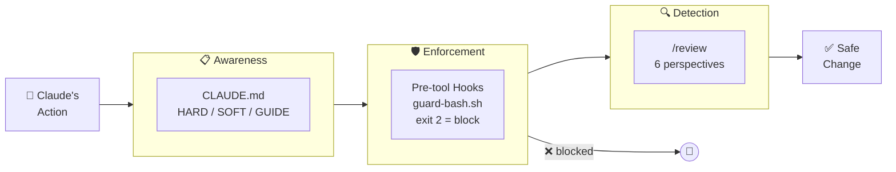
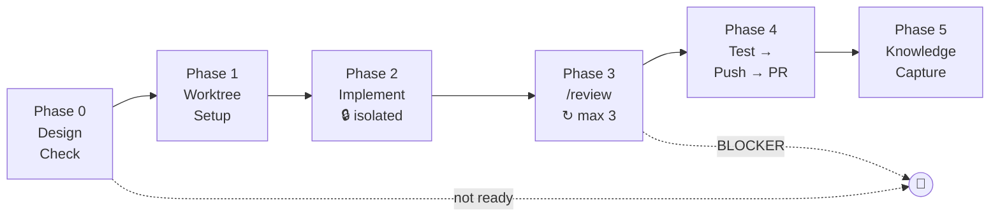

# sidekick

[日本語版 README はこちら](README.ja.md)

**Claude Code without the "oops."**

Safety hooks, reusable skills, and a learning memory — so AI works *with* your rules, not around them. Sleep while your issues turn into PRs.

---

## Why sidekick?

Claude Code is powerful but dangerous out of the box. One wrong command can push to production, drop a table, or overwrite your `.env`. And without persistent memory, every session starts from zero.

sidekick solves this with three layers:

```
Layer 1: Safety          → Hooks physically block dangerous operations
Layer 2: Skills          → Reusable workflows (review, setup, auto-implement)
Layer 3: Knowledge       → Feedback → principles → thinking OS (grows over time)
```

### What happens without sidekick

```
You: "Fix the login bug"
Claude: *modifies .env* *pushes to main* *drops test data*
You: "..."
```

### What happens with sidekick

```
You: "Fix the login bug"
Claude: → Creates worktree (not touching main)
        → Checks DB connection (staging confirmed)
        → Implements fix → Runs scoped tests
        → /review (code + test + ops)
        → Creates PR (not merging — that's your call)
```

---

## Quick Start

### New project (template)

```bash
# 1. Create from template
gh repo create my-project --template SideMountain/claude-code-sidekick

# 2. Setup
cd my-project
cp MEMORY.md.example MEMORY.md
claude  # then run /setup
```

### Existing project (adopt)

```bash
# 1. Copy core files
cp -r sidekick/CLAUDE.md sidekick/.claude/ sidekick/.rules/ your-project/
cp sidekick/MEMORY.md.example your-project/

# 2. Merge .gitignore entries
cat sidekick/.gitignore >> your-project/.gitignore

# 3. Configure
cd your-project && claude  # then run /setup
```

---

## How It Works

### Safety: Three-layer defense



| Layer | Mechanism | Example |
|-------|-----------|---------|
| **Awareness** | CLAUDE.md rules (HARD/SOFT/GUIDE) | "Don't push to main" |
| **Enforcement** | Pre-tool hooks (exit 2 = block) | `guard-bash.sh` blocks `rm -rf` |
| **Detection** | `/review` skill (6 perspectives) | Catches security issues in PR |

**Hard blocks** (never overridden, even in auto mode):
- `prisma db push`, `rm -rf`, force push, `.env` modification, push to protected branches

**Soft warnings** (auto-approved in `SIDEKICK_AUTO=true` mode):
- `git push` to feature branches, `gh pr create`, `gh pr merge` (non-protected)

### Skills: 14 reusable workflows

| Category | Skills | Purpose |
|----------|--------|---------|
| **Review** | `/review`, `/review-code`, `/review-test`, `/review-ops`, `/review-design`, `/review-spec` | Dynamic scope detection — only runs relevant perspectives |
| **Lifecycle** | `/setup`, `/close-chat`, `/weekly-review`, `/news` | Session & project management |
| **Knowledge** | `/record-decision`, `/inventory` | ADR recording, version tracking |
| **Automation** | `/auto-implement` | Full auto: implement → test → review → PR |

### Knowledge Pipeline: Sessions → Principles

```
Session 1: "Don't mock the database in tests"
  → saved to feedback_testing.md

Session 2: "Use real DB for integration tests too"
  → saved to feedback_testing.md (2nd occurrence)

Session 3: "Always test against staging DB"
  → 3rd occurrence detected → promoted to thinking.md §1

Future sessions: Claude automatically follows the principle
```

### Auto Mode: Hand off and walk away

After a design discussion, hand off implementation:

```
You: "Design looks good. /auto-implement #10, #11, #12"
Claude: → Creates 3 worktrees in parallel
        → Implements each issue independently
        → Runs /review on each
        → Pushes and creates 3 PRs
You: *reviews PRs when ready*
```

For fully unattended execution (overnight, AFK):

```bash
SIDEKICK_AUTO=true claude --dangerouslySkipPermissions \
  -p "/auto-implement #10, #11, #12"
```

**`/auto-implement` pipeline:**



**What you see in the morning:**

```
=== /auto-implement report (3 parallel) ===

[Overall] 2 succeeded ✅ / 1 stopped 🛑

── Issue #10: User auth ── ✅
  [PR] #43 → release/stg
  Changes: 8 files (+342, -28)
  Tests: 156 passed / Review: OK (1 Ops WARN → fixed)
  Knowledge: 1 flag / Backlog: 2 items

── Issue #11: Email templates ── ✅
  [PR] #44 → release/stg
  Changes: 4 files (+89, -12)
  Tests: 160 passed / Review: OK

── Issue #12: Dashboard ── 🛑
  [Stopped at] Phase 3 (review)
  [Reason] BLOCKER: N+1 query in lib/dashboard.ts L45
  [Resume] Fix N+1 → re-run /auto-implement #12

── Next actions ──
  → Review & merge PR #43, #44
  → Fix #12's N+1 in interactive mode or re-run after fix
==========================================================
```

**What stays manual** (even in auto mode):
- PR merge to main
- DB migrations
- Production deploys

For advanced setups (cron polling, Slack integration), see [cron-setup-guide.md](docs/cron-setup-guide.md).

---

## Architecture

```
sidekick/
├── CLAUDE.md                    # Rules & configuration (HARD/SOFT/GUIDE)
├── .claude/
│   ├── hooks/                   # Safety enforcement layer
│   │   ├── guard-bash.sh        # 9 guards (push, rm, prisma, env, etc.)
│   │   ├── guard-commit-message.sh
│   │   ├── guard-db-operation.sh
│   │   ├── guard-protected-branch-edit.sh
│   │   ├── prompt-reminder.sh
│   │   └── session-start.sh
│   ├── skills/                  # 14 reusable workflows
│   │   ├── review/              # Orchestrator + agents/ + references/
│   │   ├── auto-implement/      # Full automation pipeline
│   │   ├── close-chat/          # Session wrap-up + knowledge reflux
│   │   └── ...
│   ├── rules/                   # Domain-specific guidelines
│   │   ├── thinking.md          # Owner's decision principles
│   │   ├── knowledge-map.md     # Where knowledge goes
│   │   └── ...
│   └── settings.json            # Permissions, hooks, deny list
├── docs/
│   ├── decisions/               # Architecture Decision Records
│   ├── cron-setup-guide.md      # Night batch automation
│   └── playwright-setup-guide.md
└── .github/
    ├── ISSUE_TEMPLATE/          # Feature request & bug report
    └── labels.yml               # Label relay for issue-driven flow
```

---

## Configuration

Set in `Project Configuration` at the top of `CLAUDE.md`:

| Setting | Description | Default |
|---------|-------------|---------|
| `PROJECT_NAME` | Project name | `""` |
| `STG_ENABLED` | Staging environment | `false` |
| `ORM_TYPE` | `prisma` / `drizzle` / `none` | `none` |
| `LANGUAGE` | `typescript` / `python` | `typescript` |
| `NOTION_ENABLED` | External task DB integration | `false` |
| `TEST_COMMAND` | Test runner | `""` |
| `BUILD_COMMAND` | Build command | `""` |

### Scaling: Individual → Team

sidekick works for solo developers and small teams alike. No separate "enterprise edition."

| Setting | Solo | Team |
|---------|------|------|
| Worktree usage | Optional | Essential (parallel work) |
| `/review` | Self-review | Team review gate |
| `PROTECTED_BRANCHES` | `main` | `main`, `release/stg` |
| MEMORY.md | Personal notes | Shared context |

---

## Design Principles

1. **Safety first**: Hard blocks are never overridden. Not by auto mode, not by user request, not by clever workarounds.

2. **Blacklist over whitelist**: Only dangerous things are listed. Everything else runs automatically. ([ADR-0002](docs/decisions/0002-blacklist-execution-and-two-lanes.md))

3. **Knowledge compounds**: Insights flow from sessions → feedback → principles → thinking OS. Your AI gets better every week.

4. **Fixed cost, not per-project**: Runs on Claude Max subscription. No API charges. Scale to 10 projects for the same $100/month. ([ADR-0003](docs/decisions/0003-slack-cron-architecture.md))

5. **Git is the source of truth**: No external DB required. MEMORY.md + ADR + GitHub Issues. Notion is optional. ([ADR-0004](docs/decisions/0004-context-consolidation-claude-code-first.md))

---

## Versioning

```markdown
<!-- sidekick_version: 0.3.0 -->
```

Each project tracks its adopted version in `MEMORY.md`. Run `/inventory` to check for updates.

## License

MIT

<!-- sidekick_version: 0.3.0 -->
