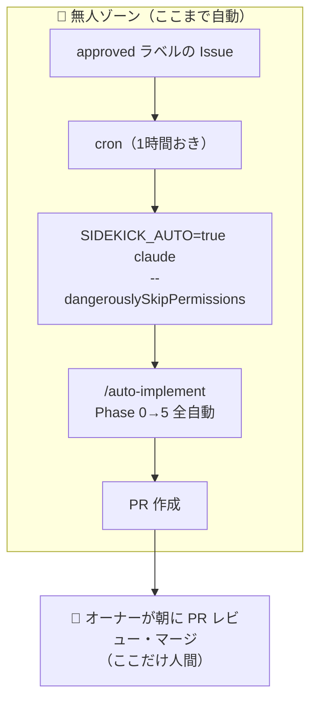

# cron 実行セットアップガイド

sidekick の自動実行基盤（ADR-0003）。
Claude Code CLI をローカル PC 上で cron 実行し、Issue 駆動の自動開発を実現する。

## 前提

- Claude Max サブスクリプション（$100/月。API 従量課金なし）
- ローカル PC に Claude Code CLI がインストール済み
- 各 PJ のリポジトリがローカルにクローン済み

## アーキテクチャ



## cron スケジュール

```cron
# 1時間おき（09:00-20:00 JST）: approved Issue の自動実装
0 9-20 * * * /path/to/scripts/cron-implement.sh

# 夜間並列バッチ（22:00）: 溜まった approved Issue を並列処理
0 22 * * * /path/to/scripts/cron-batch.sh

# 毎朝 09:00: 全PJの /inventory 実行
0 9 * * * /path/to/scripts/cron-inventory.sh

# 毎日 19:00: 日次サマリ → Slack通知
0 19 * * * /path/to/scripts/cron-daily-summary.sh

# 毎週月曜 10:00: /weekly-inventory 実行
0 10 * * 1 /path/to/scripts/cron-weekly-inventory.sh
```

## 二重実行防止

```bash
LOCK_FILE="/tmp/.claude-cron-${PROJECT_NAME}.lock"

if [ -f "$LOCK_FILE" ]; then
  echo "Already running (lock: $LOCK_FILE). Skipping."
  exit 0
fi

trap "rm -f $LOCK_FILE" EXIT
touch "$LOCK_FILE"
```

## cron-implement.sh（日中: 1件ずつ順次）

```bash
#!/bin/bash
set -euo pipefail

PROJECT_DIR="/path/to/your/project"
LOCK_FILE="/tmp/.claude-cron-$(basename $PROJECT_DIR).lock"

# 二重実行防止
if [ -f "$LOCK_FILE" ]; then exit 0; fi
trap "rm -f $LOCK_FILE" EXIT
touch "$LOCK_FILE"

# ACTIVE_HOURS チェック
HOUR=$(TZ=Asia/Tokyo date +%H)
if [ "$HOUR" -lt 9 ] || [ "$HOUR" -ge 20 ]; then
  echo "Outside active hours. Skipping."
  exit 0
fi

cd "$PROJECT_DIR"

# approved ラベルの Issue を1件取得
ISSUE=$(gh issue list --label approved --limit 1 --json number,title --jq '.[0]')
if [ -z "$ISSUE" ] || [ "$ISSUE" = "null" ]; then
  exit 0
fi

ISSUE_NUM=$(echo "$ISSUE" | jq -r '.number')

# ラベルを implementing に変更（他 cron が拾わない）
gh issue edit "$ISSUE_NUM" --remove-label approved --add-label implementing

# /auto-implement で全自動実行
SIDEKICK_AUTO=true claude --dangerouslySkipPermissions \
  -p "/auto-implement #${ISSUE_NUM}"

# 完了後ラベル変更
gh issue edit "$ISSUE_NUM" --remove-label implementing --add-label needs-review
```

## cron-batch.sh（夜間: 並列処理）

```bash
#!/bin/bash
set -euo pipefail

PROJECT_DIR="/path/to/your/project"
LOCK_FILE="/tmp/.claude-cron-batch-$(basename $PROJECT_DIR).lock"

if [ -f "$LOCK_FILE" ]; then exit 0; fi
trap "rm -f $LOCK_FILE" EXIT
touch "$LOCK_FILE"

cd "$PROJECT_DIR"

# approved ラベルの Issue を最大3件取得
ISSUES=$(gh issue list --label approved --limit 3 --json number --jq '.[].number')
if [ -z "$ISSUES" ]; then
  exit 0
fi

# Issue 番号をカンマ区切りに
ISSUE_LIST=$(echo "$ISSUES" | tr '\n' ',' | sed 's/,$//')

# 全 Issue のラベルを implementing に変更
for NUM in $ISSUES; do
  gh issue edit "$NUM" --remove-label approved --add-label implementing
done

# /auto-implement で並列実行
SIDEKICK_AUTO=true claude --dangerouslySkipPermissions \
  -p "以下のIssueを /auto-implement で並列実装してください: #$(echo $ISSUES | tr '\n' ', #' | sed 's/, #$//')"

# 完了後ラベル変更
for NUM in $ISSUES; do
  gh issue edit "$NUM" --remove-label implementing --add-label needs-review
done
```

## 安全策

| 区分 | 対象 |
|---|---|
| 🚫 **絶対に自動実行しない**（SIDEKICK_AUTO でも止まる） | `prisma db push`（Guard 6）/ 保護ブランチへの直接 push（Guard 2）/ `rm -rf`（Guard 5）/ `.env DATABASE_URL` の変更（Guard 4）/ 保護ブランチへの PR マージ（Guard 8）— いずれもハードブロック |
| ✅ **自動承認**（SIDEKICK_AUTO=true 時） | `git push`（feature ブランチ）/ `gh pr create` / `gh pr merge`（保護ブランチ以外） |
| 👤 **人間が判断** | PR のレビュー・マージ（朝のルーティン）/ DB マイグレーション / 本番デプロイ |

## SIDEKICK_AUTO の使い方

```bash
# cron スクリプト内でのみ設定する（推奨）
SIDEKICK_AUTO=true claude --dangerouslySkipPermissions -p "..."

# シェル全体に設定しない（対話モードでも警告が消える）
# export SIDEKICK_AUTO=true  ← これはやらない
```

## 注意事項

- cron スクリプトは各 PJ のリポジトリ外に配置する（sidekick テンプレートには含まない）
- Slack 通知は Slack App またはシンプルな webhook で実装
- 夜間バッチの並列数は最大 3 件を推奨（PC リソースに依存）
- 1 PJ につき同時実行は 1 タスクまで（ロックファイルで制御。バッチはClaude Code内で並列化）
- STG デプロイ後の自動 E2E テスト（PR 作成後の下流工程）は [playwright-setup-guide.md](playwright-setup-guide.md) を参照
