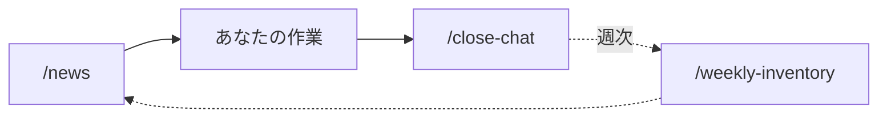
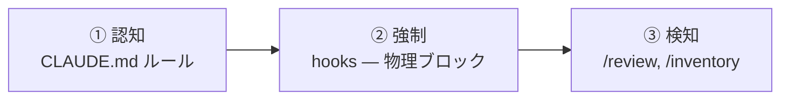

# sidekick — 設計思想

sidekick の**現在の**設計を1枚で掴むダイジェストです。判断の履歴や番号は持ちません — 各選択の理由とトレードオフは [`docs/decisions/`](./decisions/) の ADR を参照してください。

---

## 北極星

> **下流はハーネスの複雑さを意識しない。デフォルトのまま安全、組み立て不要。**

すべての設計判断はこれに照らして評価します。利用者に「組み立て・選択・記憶」を増やす機能は疑い、自動で動きデフォルトで安全に倒れる機能を採ります。

## 回すループ

能動的に意識するのは**3つの動詞**だけ。残りは配管です。

| 能動 — あなたが実行 | 受動 — 自動で動く |
|---|---|
| `/news`, `/close-chat`, 週次 `/weekly-inventory` | hooks, session-start, 自動呼び出しスキル |

## 安全 — 3層、妥協なし

認知だけでは漏れ、強制が物理的に止め、検知がすり抜けを拾う。ハードブロックは絶対に解除されない — auto モードでも、利用者の指示でも、巧妙な回避策でも。

## 思考OS — 複利で効く判断

2層の brain:

- **個人 brain**（`~/.claude/brain/thinking.md`）— 全プロジェクト横断のあなたの判断軸。自動上書きされない。
- **PJ brain**（`<project>/.claude/brain/thinking.md`）— プロジェクト固有の判断。個人 brain を1段 import。

繰り返されたフィードバックは、**あなたの承認のもと**で原則に昇格する。同じ指摘を二度しなくて済む。

## 単一リポと強制された境界

開発と配布を**単一リポ**に置く。出荷物は保守者が実際に使うものそのもので、dogfood が名目でなく構造的に成立する。固有情報は local 層（gitignore）＋ **pre-commit 強制 hook** で公開ファイルから締め出す。手動フィルタに頼らない。

## UI/UX ハーネス — 段階導入・opt-in

UI 品質（デザインシステム、トークン、アクセシビリティ、ビジュアルリグレッション）は**段階的**に、かつ opt-in した PJ にのみ導入する。UI を持たない PJ はコストゼロ。検知は path-scoped rule（新規ファイル作成で発火しない）ではなく PostToolUse hook に乗せる。

## stack pack — opt-in・規定アーキ

既知スタックの PJ には、**opt-in な stack pack** が agnostic core の上に「規定アーキ（golden path）+ システム可視化」を載せる。狙い: 下流が既知アーキに従うと、パーサは*その規約*を読むだけで**地図が決定的に描かれる** — 「汎用」と「決定的」が両立する。core（hooks / brain / 北極星 / skills）は stack 非依存のまま一次、pack は上物であって baseline ではない。**方法**（アーキ規定 → 決定性 → 強制）は stack 非依存で、Next.js は第一インスタンス。opt-in は setup 時に設定する単一フラグ（`STACK_PACK`: `none` / `nextjs`）で配線され、opt-in しない PJ はコストゼロ。Next.js pack は3層を同梱: golden path 契約（`.claude/stack-packs/nextjs/ARCHITECTURE.md`）・規約準拠のアプリ骨格を生む **scaffold**・golden path 逸脱で CI を落とす **アーキ fitness 関数**（`npm run test:arch`）— 認知 → 強制 → 検知。

## 全体を貫く原則

| 原則 | 一言 |
|---|---|
| **仕組み化の3層** | 認知 → 強制 → 検知。ルールだけでは守れない |
| **ブラックリスト方式** | 危険なものだけリスト化、残りは全自動 |
| **Git が Source of Truth** | 外部 DB 不要。Notion はオプション |
| **固定費** | Claude Max 上で動く。PJ 比例の API 課金なし |
| **知識が複利で効く** | feedback → 原則 → 自動適用 |

---

*これらの背後にある判断 — 比較した選択肢と却下したもの — は [`docs/decisions/`](./decisions/) に記録されています。*
