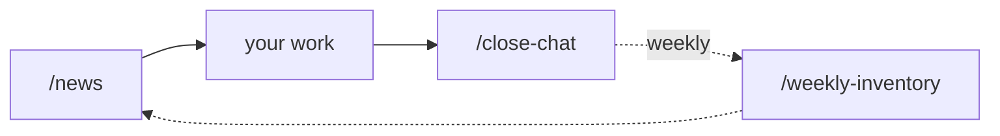
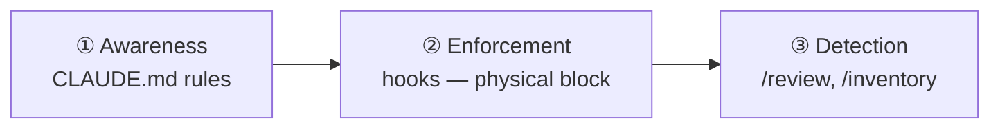

# sidekick — Design Philosophy

A one-glance digest of how sidekick is designed **today**. It carries no decision history or numbering — for the reasoning and trade-offs behind each choice, see the Architecture Decision Records in [`docs/decisions/`](./decisions/).

---

## North Star

> **Downstream doesn't feel the harness's complexity. Default-safe, nothing to assemble.**

Every design choice is judged against this. A feature that makes you assemble, choose, or memorize more is suspect. A feature that fires on its own and stays safe by default earns its place.

## The loop you run

Your active surface area is **three verbs**. Everything else is plumbing.

| Active — you run | Passive — fires for you |
|---|---|
| `/news`, `/close-chat`, weekly `/weekly-inventory` | hooks, session-start, auto-invoked skills |

## Safety — three layers, non-negotiable

Awareness alone leaks; enforcement physically blocks; detection catches what slips through. Hard blocks are never overridden — not by auto mode, not by user request, not by a clever workaround.

## Thinking OS — judgment that compounds

A two-layer brain:

- **Personal brain** (`~/.claude/brain/thinking.md`) — your decision axis, portable across every project, never auto-overwritten.
- **PJ brain** (`<project>/.claude/brain/thinking.md`) — project-specific judgment; imports the personal brain in one hop.

Repeated feedback is promoted to a principle — **with your approval** — so the AI stops needing the same correction twice.

## Thinking harness — hard calls are never single-shot

Learning fixes *what* Claude decides; the harness governs *how carefully*. A closed set of **hard calls** — design decisions, root-cause analysis, contradiction arbitration, security changes, final merge/release judgments — is flagged by a deterministic machine check (`detect-hard-spot.sh`, a force-flag the model can add to but not veto) plus the model's own judgment, then must clear a verification-volume ladder before it resolves — never single-shot. Judgment quality is regression-tested against a **frozen judgment corpus** (append-only, held-out split), so the harness re-measures on the same baseline whenever it changes.

> **ladder** — L1: ≥1 adversarial pass (every hard call) · L2: 3 independent votes (design / arbitration) · L3: execution is the arbiter (root-cause) · L4: multi-agent + `min()` (merge / release).

## Context economy — long runs on a fixed cap

A fixed Claude Max cap is a budget, so **resident context is a liability, not an asset**: the default is *retrieve > resident*, deep references live in lazy-load docs, and each model/subagent gets only what its task needs. A budget-gate reads the live rate-limit and stages down at 60% / 85% — advisory first, then one bounded wrap-up turn — and is **fail-open**: missing or stale data falls back to normal, and safety guards run independently of budget state, so a hot cap never weakens a hard block.

## One repo, enforced boundary

Development and distribution live in a **single repository**, so what ships is what the maintainer actually uses — dogfooding is structural, not nominal. Personal information is kept out of public files by a local layer (gitignored) plus a **pre-commit enforcement hook**, not by a manual filter.

## UI/UX harness — staged, opt-in

UI quality (design system, tokens, accessibility, visual regression) is introduced **in stages**, and only for projects that opt in — a project without UI pays nothing. Detection rides a PostToolUse hook rather than path-scoped rules, which do not fire on file creation.

## Stack pack — opt-in, prescriptive architecture

For projects on a known stack, an **opt-in stack pack** layers a prescriptive architecture (a "golden path") plus a system visualizer on top of the agnostic core. The bet: when downstream follows a fixed architecture, a parser reads *that* convention and the system map draws itself **deterministically** — "generic" and "deterministic" stop being mutually exclusive. The core (hooks, brain, north star, skills) stays stack-independent; the pack is an upper layer, never the baseline. The *method* (prescribe architecture → determinism → enforce) is stack-agnostic; Next.js is the first reference instance. Opt-in is wired through a single config flag (`STACK_PACK`: `none` / `nextjs`) set during setup — a project that does not opt in pays nothing. The Next.js pack ships three layers: the golden-path contract (`.claude/stack-packs/nextjs/ARCHITECTURE.md`), a **scaffold** that generates a conforming app skeleton, and **architecture fitness functions** (`npm run test:arch`) that fail CI on golden-path deviations — recognize → enforce → detect.

## Principles that cut across everything

| Principle | In one line |
|---|---|
| **Mechanize in 3 layers** | awareness → enforcement → detection; rules alone don't hold |
| **Blacklist over whitelist** | list only the dangerous; everything else just runs |
| **Git is the source of truth** | no external DB required; Notion is optional |
| **Fixed cost** | runs on Claude Max; no per-project API charges |
| **Knowledge compounds** | feedback → principle → applied automatically |
| **Hard calls are never single-shot** | escalation ladder + frozen judgment corpus |
| **Context is a liability, not an asset** | retrieve > resident; lazy-load; fail-open budget-gate |

---

*The decisions behind these — the options weighed and the ones rejected — are recorded in [`docs/decisions/`](./decisions/).*
