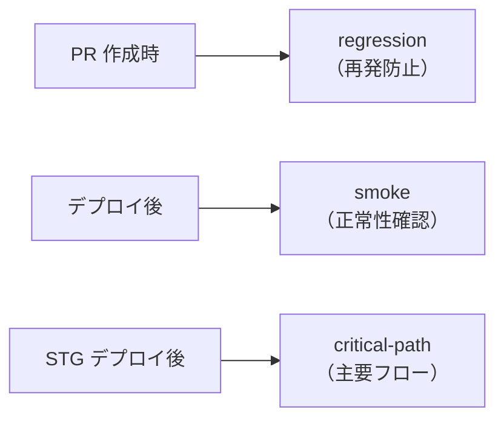

# Playwright E2E テストセットアップガイド

sidekick テンプレートのPJで Playwright を導入する際のガイド。
ADR-0003 の Lane 1（Issue 駆動）で、STG デプロイ後の自動 E2E テストに使用する。

## ディレクトリ構造

```
e2e/
├── playwright.config.ts    # Playwright 設定
├── fixtures/
│   └── base.ts             # 共通フィクスチャ（認証状態等）
├── pages/
│   └── *.page.ts           # Page Object Model
└── tests/
    ├── smoke/               # スモークテスト（デプロイ後の基本確認）
    │   └── health.spec.ts
    ├── critical-path/       # クリティカルパス（主要ユーザーフロー）
    │   └── *.spec.ts
    └── regression/          # リグレッション（バグ修正の再発防止）
        └── *.spec.ts
```

## テストカテゴリと実行タイミング

| カテゴリ | 実行タイミング | 目的 |
|---------|--------------|------|
| smoke | 毎デプロイ後 | サービス正常性の基本確認 |
| critical-path | STG デプロイ後 | 主要ユーザーフローの確認 |
| regression | PR 作成時 | バグ再発防止 |



## playwright.config.ts テンプレート

```typescript
import { defineConfig, devices } from '@playwright/test';

export default defineConfig({
  testDir: './e2e/tests',
  fullyParallel: true,
  forbidOnly: !!process.env.CI,
  retries: process.env.CI ? 2 : 0,
  workers: process.env.CI ? 1 : undefined,
  reporter: [
    ['html', { open: 'never' }],
    ['json', { outputFile: 'e2e/results.json' }],
  ],
  use: {
    baseURL: process.env.BASE_URL || 'http://localhost:3000',
    trace: 'on-first-retry',
    screenshot: 'only-on-failure',
  },
  projects: [
    {
      name: 'chromium',
      use: { ...devices['Desktop Chrome'] },
    },
  ],
});
```

## スモークテスト例

```typescript
// e2e/tests/smoke/health.spec.ts
import { test, expect } from '@playwright/test';

test('トップページが正常に表示される', async ({ page }) => {
  await page.goto('/');
  await expect(page).toHaveTitle(/.+/);
  // ステータスコード 200 を確認
});

test('APIヘルスチェックが正常', async ({ request }) => {
  const response = await request.get('/api/health');
  expect(response.ok()).toBeTruthy();
});
```

## GitHub Actions 連携

```yaml
# .github/workflows/e2e.yml
name: E2E Tests
on:
  deployment_status:
    # STG デプロイ完了後にトリガー

jobs:
  e2e:
    if: github.event.deployment_status.state == 'success'
    runs-on: ubuntu-latest
    steps:
      - uses: actions/checkout@v4
      - uses: actions/setup-node@v4
      - run: npx playwright install --with-deps chromium
      - run: npx playwright test e2e/tests/smoke/
        env:
          BASE_URL: ${{ github.event.deployment_status.target_url }}
      - uses: actions/upload-artifact@v4
        if: failure()
        with:
          name: playwright-report
          path: playwright-report/
```

## 注意事項

- テストデータは毎回セットアップ/クリーンアップする（テスト間の依存を排除）
- 認証が必要なテストは fixtures/base.ts で共通化する
- Page Object Model を使い、セレクタの重複を防ぐ
- CI での実行は chromium のみで十分（マルチブラウザはオプション）
